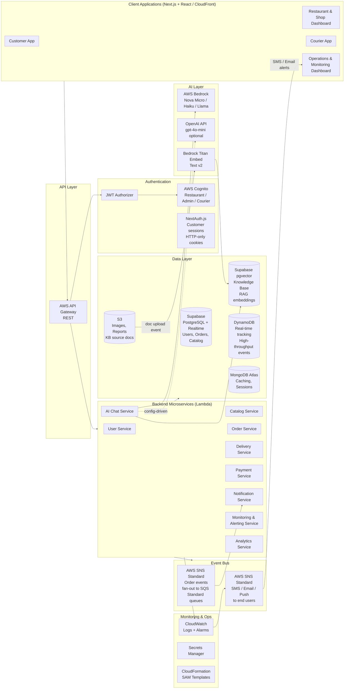
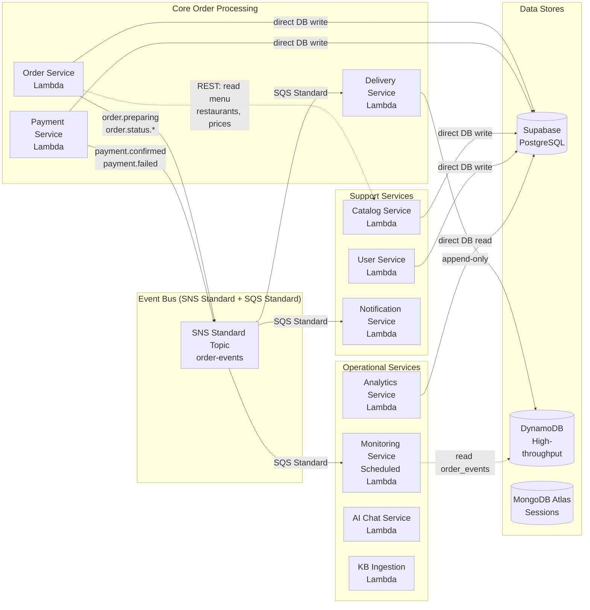
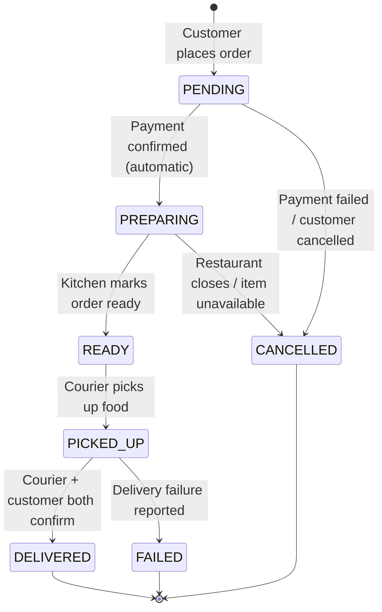
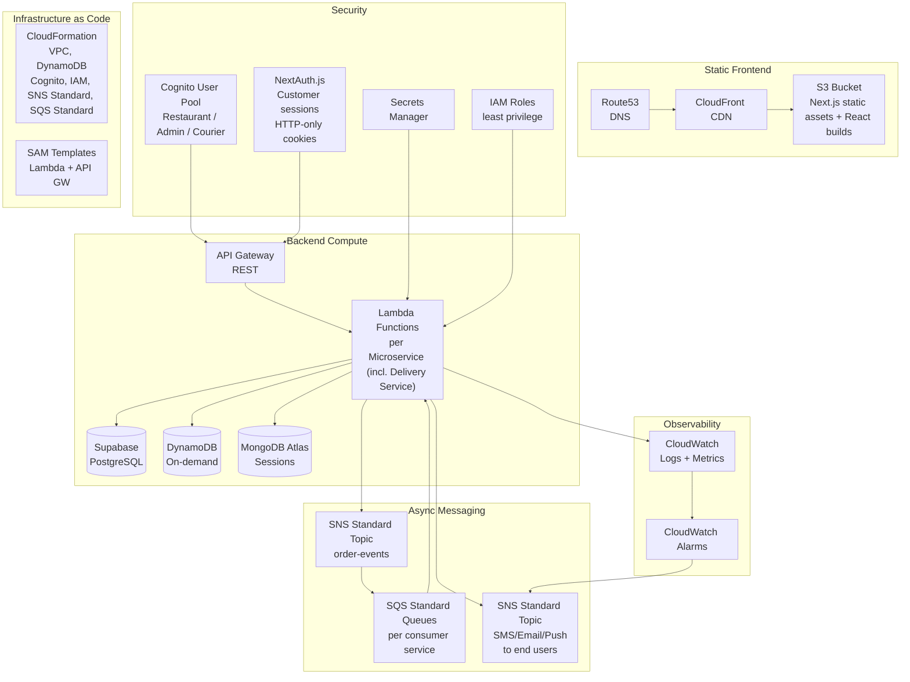
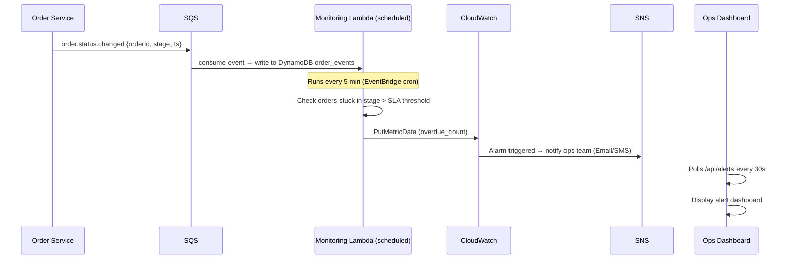
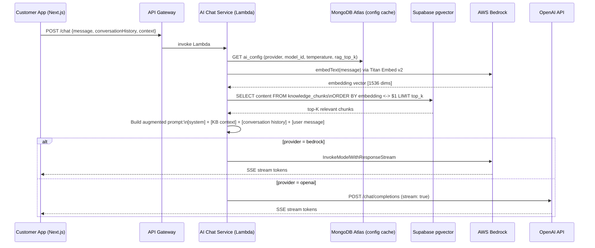
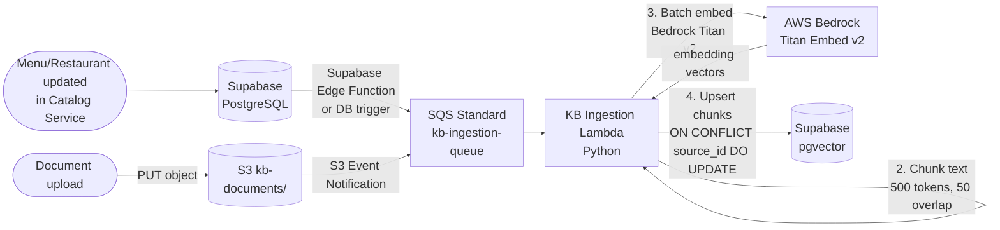
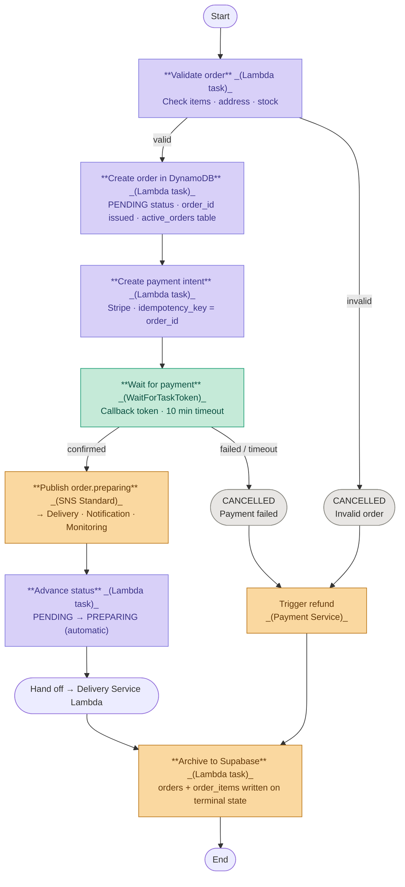
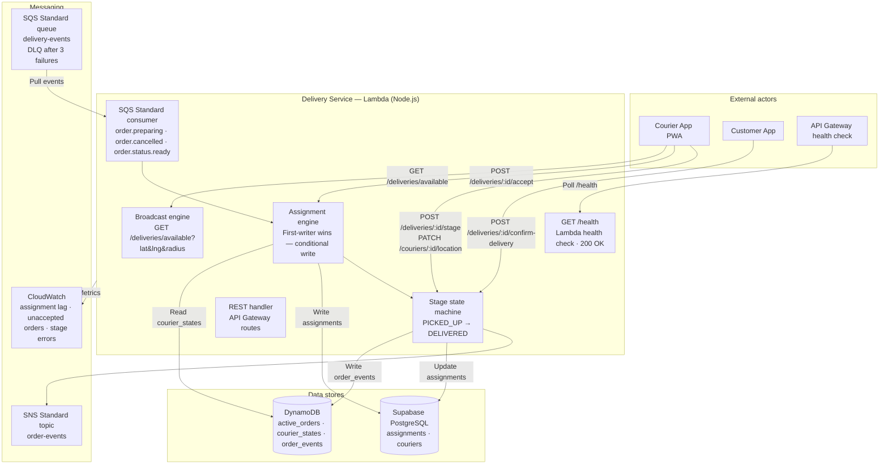

# Food Delivery Platform — High Level Architecture (HLA) + MVP Plan

**Scale:** ~100,000 users | 300 restaurants | 2,000 couriers  
**Stack:** Next.js (Customer Web) + React (Ops apps) · Node.js/FastAPI · AWS Lambda · Supabase (PostgreSQL + pgvector) · DynamoDB · MongoDB Atlas · AWS (Cognito [Restaurant/Admin/Courier], SNS Standard, SQS Standard, Bedrock, CloudWatch, S3/CloudFront) · NextAuth.js (Customer auth) · OpenAI API (optional)

---

## 1. System Overview

The platform covers the **full delivery lifecycle** with real-time monitoring of every stage:

```
Customer → Browse → Order → Payment → [auto] Preparing → Pickup → Delivered
                                  ↑ Every stage is tracked & monitored ↑
```

**Four client apps:**
| App | Users | Platform |
|---|---|---|
| Customer App | 100K end-users | Next.js (SSR/SSG, SEO-first) |
| Restaurant / Shop Dashboard | 300 restaurants + 10K shops | React |
| Courier App | 2,000 couriers | React PWA |
| Operations & Monitoring Dashboard | Admin / ops team | React |

---

## 2. High Level Architecture Diagram



---

## 2.1 Service Interaction & Request Flow

This diagram traces a live order request from client entry point through all service dependencies, showing synchronous calls, event publishing, and shared data/observability sinks.


**Key flows illustrated:**
- **Synchronous orchestration** (solid arrows): Order Service calls Menu Service to validate item availability and Payment Service to initiate checkout; Delivery Service feeds ETA and courier updates back into Order Service
- **Payment callback loop**: Payment provider posts confirmation back through API Gateway → Order Service state transition
- **Async fan-out** (Event Bus): Order and delivery events publish to SNS Standard → SQS Standard queues; independent subscriber services (Notifications, Monitoring, Analytics) consume without blocking the critical path
- **Shared sinks**: All services write to the unified data layer and push metrics/logs to CloudWatch

---

## 3. Frontend Applications

### 3.1 Customer App (Next.js)

**Pages / Features:**
- SEO-first pages with SSR/SSG (home, cuisine/category, restaurant, item details)
- Login / Registration (NextAuth.js — HTTP-only cookies)
- Browse restaurants & shops (search, filter, category)
- Product catalog & cart
- Order placement & payment
- **Live order tracking** (polling `GET /api/v1/orders/{orderId}` every 5 seconds — reads DynamoDB `active_orders`)
- Order history
- Profile & addresses
- **AI Chat widget** — floating assistant: order status Q&A, allergen/dietary queries, menu recommendations, support

### 3.2 Restaurant & Shop Dashboard (React)

**Pages / Features:**
- Login (role: `RESTAURANT` — Cognito)
- Incoming orders queue (polling `GET /orders?status=preparing` every 5 seconds)
- Mark order READY when food is prepared
- Menu management (CRUD) with AI-assisted dish card filling — AI helper generates description, calories, and nutrition parameters from dish name or photo (Bedrock)
- Availability toggle (open / closed)
- Sales reports (daily, weekly)

### 3.3 Courier App (React PWA)

**Pages / Features:**
- Login (role: `COURIER` — Cognito)
- Browse available orders within X km of current location; first courier to accept wins the assignment
- Stage updates: `PICKED_UP → DELIVERED`
- Location update via REST (~30 sec interval when actively delivering)
- Earnings summary

### 3.4 Operations & Monitoring Dashboard (React)

**Pages / Features:**
- All active orders board (stage pipeline view)
- Alert inbox (CloudWatch → polling every 30 sec)
- SLA violations / overdue orders
- Courier map (live positions)
- User / restaurant / courier management (Admin role)
- System health metrics

---

## 4. Backend Microservices

### 4.1 Architecture Overview

The backend follows an **event-driven microservices** architecture with strict domain boundaries. Each service owns its data, exposes async-first APIs, and communicates via SNS Standard + SQS Standard for async fan-out. This eliminates tight coupling while maintaining transactional integrity for order workflows.



---

### 4.2 Service Catalog & Responsibilities

| Service | Domain | Responsibility | Runtime | Concurrency | API Type |
|---|---|---|---|---|---|
| **Order Service** | Order Processing | Order creation, state machine (PENDING→PREPARING→READY→PICKED_UP→DELIVERED), event publishing | Lambda (Node.js) | 500–1000 concurrent | REST + SNS publisher |
| **Payment Service** | Payment | Payment intent creation, confirmation, refunds. Stripe/payment provider integration | Lambda (Node.js) | 100–200 concurrent | REST + SNS publisher |
| **Delivery Service** | Delivery Coordination | Courier broadcast + proximity assignment, stage updates (PICKED_UP→DELIVERED) | Lambda (Node.js) | 50–200 concurrent | REST + SNS subscriber |
| **User Service** | Identity & Profile | User registration, authentication, profile/address management, role assignment | Lambda (Node.js) | 200–500 concurrent | REST |
| **Catalog Service** | Catalog | Menu/product CRUD, category management, availability toggles, search indexing, AI-assisted dish card generation (Bedrock) | Lambda (Node.js) | 50–100 concurrent | REST + Supabase triggers |
| **Notification Service** | Notifications | Order status notifications (SMS/email/push via SNS Standard), template rendering | Lambda (Node.js) | 200–500 concurrent | SNS subscriber |
| **Monitoring Service** | Operations | SLA tracking, overdue order detection, alert generation (5-min schedule) | Scheduled Lambda | 1–2 concurrent | CloudWatch → SNS |
| **Analytics Service** | Business Intelligence | Daily/weekly aggregations, restaurant stats, order trends | Lambda (Python/FastAPI) | 10–50 concurrent | REST |
| **AI Chat Service** | Customer Support | RAG-powered Q&A, LLM routing (Bedrock/OpenAI) | Lambda (Node.js) | 50–100 concurrent | REST + SSE streaming |
| **KB Ingestion Service** | Knowledge Management | Document chunking (500-token windows), embedding generation, pgvector upsert | Lambda (Python) | 5–10 concurrent | SQS subscriber + S3 events |

---

### 4.3 Service Communication Patterns

#### Synchronous (REST) — Order-Independent Operations
- **User Service** ← Customer App (login, profile)
- **Catalog Service** ← Customer/Restaurant apps (browse menu, update availability)
- Used for **read-heavy** or **non-blocking** operations. No dependency on event ordering.

#### Asynchronous (SNS Standard + SQS Standard) — Order Events

- **Order Service** → SNS Standard → **Delivery Service**, **Notification Service**, **Monitoring Service**
- **Why Standard (not FIFO)?** At MVP scale (100K users, 300 restaurants), Standard SNS/SQS is simpler to operate, ~10× cheaper, and has no 300 TPS limit. Each consumer checks current order state before acting, handling any rare duplicates gracefully.

**Event Publishing Pattern:**
```
Order Service publishes event → SNS Standard (single topic)
                            ↓
                    (fan-out via subscriptions)
                    ↙            ↓            ↘
          SQS Standard (DS)  SQS Standard (NS)  SQS Standard (MS)
                ↓                  ↓                  ↓
         [Delivery Svc]      [Notification]      [Monitoring]
```

Each consumer (DS, NS, MS) operates independently without blocking others. Failure in one queue (e.g., Notification down) doesn't block Delivery or Monitoring.

---

### 4.4 Error Handling & Resilience

#### Timeouts & Circuit Breaking
| Service | Lambda Timeout | Retry Behavior | Circuit Breaker |
|---|---|---|---|
| Order Service | 30 sec | Exponential backoff (1s, 2s, 4s) on DB transient errors | N/A (Supabase is highly available) |
| Payment Service | 60 sec | Max 3 retries on network errors; fail-open on timeout (manual reconciliation queue) | Stripe API circuit breaker (fail-safe mode) |
| Delivery Service | 30 sec (Lambda) | Exponential backoff (1s, 2s, 4s) on transient errors | N/A |
| Notification Service | 60 sec | SNS Standard handles retries (max 15 minutes); DLQ captures permanent failures | SNS built-in retry policy |

#### Dead Letter Queues (DLQ)
- **SQS Standard DLQ** attached to each consumer queue (DS, NS, MS)
- Messages that fail > 3 times go to DLQ for manual inspection
- Separate Lambda monitors DLQ and alerts ops on poison messages
- Example: corrupted event schema → moved to DLQ, doesn't block queue

#### Idempotency
Application-level idempotency (DynamoDB `idempotency_records` table) is deferred post-MVP. Stripe's native `idempotency_key` prevents double-charging at the payment layer. All events include `timestamp` and `actor_id` for audit trail.

---

### 4.5 Data Consistency & Transaction Handling

#### Strong Consistency (ACID) — Core Transactional Data
- **DynamoDB `active_orders`**: all in-flight order state — strong consistency within a single item write (`PutItem` / `UpdateItem`)
- **Supabase PostgreSQL**: users, restaurants, menu_items, and archived orders written once on terminal state (DELIVERED / CANCELLED / FAILED), then immutable
- Single-database ACID transactions within a service (no cross-service distributed transactions)
- Example: Order creation is atomic — a single DynamoDB `PutItem` issues the `orderId` and sets `PENDING` status

#### Eventual Consistency — Event-Driven Updates
- **Order status propagation**: Order Service writes status transitions to DynamoDB `active_orders` → publishes SNS Standard events → Monitoring/Notification services consume; on terminal state, archives full order to Supabase PostgreSQL
- Clients may see stale order status for up to 5 seconds (polling interval)
- **Acceptable trade-off**: Customer App polls `GET /api/v1/orders/{orderId}` for order status

#### No Distributed Transactions
- **Why?** Synchronous 2PC across services is slow and brittle. Instead:
  - Order Service writes to DB + publishes event atomically
  - Consumers check current state before acting, handling rare duplicate deliveries gracefully
  - If a service crashes mid-processing, SQS retries the message

---

### 4.6 Scalability & Deployment

#### Lambda Concurrency Management
| Service | Baseline | Burst | Throttle Behavior |
|---|---|---|---|
| Order Service | 200 concurrent | 500 (lunch peak 12–14:00) | Queue incoming requests; alert ops if > 30 sec wait |
| Payment Service | 50 concurrent | 100 | Fail immediately if throttled (return 429 to client) |
| Delivery Service (Lambda) | 50 concurrent | 200 concurrent (lunch peak) | Lambda auto-scales; concurrency limit 200 |
| Notification Service | 200 concurrent | 500 | SNS handles queueing; Lambda processes from SQS |

#### Environment Promotion
- **Dev**: All services co-located in single AWS account, logging to CloudWatch Logs Insights
- **Staging**: Identical production stack; blue/green deployment via CloudFormation
- **Production**: All services on Lambda (auto-replicated across AZs)

#### CI/CD Pipeline
- GitHub Actions triggers on push to `main` branch
- SAM builds Lambda artifacts (Node.js/Python), unit tests run
- CloudFormation validates IaC templates
- Deploy to staging for smoke tests (e.g., place test order end-to-end)
- Manual approval for production deployment
- Rollback via CloudFormation stack update (previous template version)

---

### 4.7 Service Boundaries & Data Ownership

**Each service owns its data. No cross-service database writes.**

| Service | Owned Tables | External Dependencies |
|---|---|---|
| Order Service | `active_orders` (DynamoDB — live state); `orders`, `order_items` (Supabase — archive on terminal state) | Reads: `menu_items`, `restaurants`, `payments` (via REST, cached) |
| Delivery Service | `assignments`, `courier_states`, `order_events` (→ DynamoDB) | Reads: `active_orders`, `couriers` (via REST/cache) |
| Payment Service | `payments` | Reads: `orders` (via REST); writes event to SNS |
| Notification Service | `notification_log` (audit only) | Reads: `orders`, `users` (via REST) |
| User Service | `users`, `addresses`, `profiles` | N/A |
| Catalog Service | `menu_items`, `restaurants`, `categories` | N/A |

**API Versioning:**
- All REST endpoints prefixed with `/api/v1/`
- Breaking changes → `/api/v2/` (old version remains for backward compatibility for 6 months)
- Example: `/api/v1/orders` → new field added → `/api/v1/orders` (backward compatible) OR `/api/v2/orders` (if field removed)

---

### 4.8 Monitoring & Observability per Service

| Service | Key Metrics | Alert Threshold |
|---|---|---|
| Order Service | P99 latency, order creation errors, event publication lag | > 2 sec latency, > 5% error rate |
| Payment Service | Payment failures, Stripe API latency, idempotency key mismatches | > 100 failed payments/hour, > 30 sec latency |
| Delivery Service | Courier assignment lag, unaccepted order count, stage transition errors | Assignment lag > 60 sec, unaccepted orders > 5 for > 5 min |
| Notification Service | Notification send failures, SMS delivery lag | > 1% failure rate, > 5 min delay |
| Monitoring Service | SLA violations detected, false-positive alerts | > 50 overdue orders, > 100 false alarms/day |

**CloudWatch Custom Metrics:**
- Each service publishes `ServiceName.OperationName.Duration` and `ServiceName.OperationName.ErrorCount`
- Example: `OrderService.CreateOrder.Duration` (histogram), `OrderService.CreateOrder.ErrorCount` (counter)
- Alarms trigger when error rate > threshold OR latency P99 > threshold for 5 consecutive minutes

---

### 4.9 API Contract & Request/Response Examples

#### Example: Order Service — POST /api/v1/orders

**Request:**
```json
{
  "customerId": "user-123",
  "restaurantId": "rest-456",
  "items": [
    { "menuItemId": "item-1", "quantity": 2, "specialInstructions": "no onions" }
  ],
  "deliveryAddressId": "addr-789",
  "estimatedDeliveryTime": "2026-06-23T19:00:00Z"
}
```

**Response (202 Accepted):**
```json
{
  "orderId": "order-xyz",
  "status": "PENDING",
  "createdAt": "2026-06-23T18:45:00Z"
}
```
> Upon payment confirmation, status automatically transitions to `PREPARING` without any restaurant action.

**On Error (400 Bad Request):**
```json
{
  "error": "UNAVAILABLE_ITEMS",
  "message": "Menu item item-1 is not available",
  "details": {
    "unavailableItems": ["item-1"]
  }
}
```

---

### 4.10 Service Lifecycle: Initialization & Shutdown

#### Initialization (Cold Start Optimization)
- **Lambda**: Node.js runtime pre-warmed via CloudWatch Events (ping every 5 min to keep warm)
  - Cold start ~500 ms (acceptable for MVP)
- **Database connections**: Pooled via PgBouncer (Supabase managed); MongoDB Atlas connection pooling built-in

---

### Service Responsibilities (Summary Table)

| Service | Responsibility | Runtime | Coupled To |
|---|---|---|---|
| **User Service** | Register, profile, address, roles | Lambda (Node.js) | Cognito, Supabase |
| **Catalog Service** | Menu, products, categories, availability | Lambda (Node.js) | Supabase, S3 (images) |
| **Order Service** | Order lifecycle state machine, event publishing | Lambda (Node.js) | Supabase, SNS Standard, Stripe |
| **Delivery Service** | Courier broadcast + proximity assignment, stage updates (PICKED_UP→DELIVERED) | Lambda (Node.js) | DynamoDB, Supabase, SNS Standard |
| **Payment Service** | Payment intent, confirm, refund | Lambda (Node.js) | Stripe API, SNS Standard |
| **Notification Service** | Push / SMS / email via SNS | Lambda (Node.js) | SNS Standard, SQS Standard |
| **Monitoring Service** | Check stage SLAs, alert on overdue orders | Scheduled Lambda | DynamoDB, CloudWatch, SNS |
| **Analytics Service** | Reports, aggregations | Lambda (Python/FastAPI) | Supabase, MongoDB Atlas |
| **AI Chat Service** | RAG retrieval + LLM routing (Bedrock/OpenAI) | Lambda (Node.js) | Bedrock, OpenAI, Supabase pgvector, MongoDB Atlas |
| **KB Ingestion Service** | Chunk, embed, upsert docs to pgvector | Lambda (Python) | S3, Bedrock Embed, Supabase pgvector |

---

## 5. Order State Machine (Core Business Logic)



**Every transition** → SNS Standard topic `order-events` → fan-out to SQS Standard queues → triggers Notification + Monitoring services. No photo required for delivery confirmation — both courier and customer tap "Confirm" in their respective apps.

---

## 6. Data Layer Design

### Supabase (PostgreSQL — permanent record store)
```
users            (id, email, phone, role, cognito_sub, created_at)
restaurants      (id, name, owner_id, address, is_open, rating)
menu_items       (id, restaurant_id, name, price, category, image_key,
                  time_to_prepare, labels jsonb, nutrition jsonb, ai_generated jsonb)
couriers         (id, user_id, vehicle_type, is_available)
payments         (id, order_id, provider_ref, status, amount)
```
> `menu_items` — stored entirely in Supabase (moved from MongoDB Atlas). `time_to_prepare` (minutes) is used for ETA calculation. `ai_generated` JSONB stores AI helper output (description, calories, nutrition) populated by Catalog Service via Bedrock.
>
> `orders` / `order_items` — written **once** on terminal state (DELIVERED / CANCELLED / FAILED); permanent record for history, analytics, and billing. Not written during the active order lifecycle.
>
> Customer App polls `GET /api/v1/orders/{orderId}` every 5 seconds for order status.

### DynamoDB (high-throughput, active order state + append-only audit)
```
active_orders        PK: orderId   (no SK)   full order state during active lifecycle
                     ↳ All status transitions: pending → preparing → ready → courier_assigned → picked_up → delivered
                     ↳ expiresAt TTL: auto-deleted after terminal state is archived to Supabase
                     ↳ GSI_customer_orders   (PK: customerId,    SK: createdAt)
                     ↳ GSI_restaurant_orders (PK: restaurantId,  SK: status)
                     ↳ GSI_courier_orders    (PK: courierId,     SK: updatedAt)
order_events         PK: order_id     SK: event_time  (stage, actor_id)
                     ↳ Immutable audit log: every order state transition (PENDING→PREPARING→READY→PICKED_UP→DELIVERED)
                     ↳ actor_id: the user/system that triggered the event
                       • "SYSTEM" when PENDING→PREPARING (auto on payment confirmation)
                       • courier_id when READY→PICKED_UP (courier picks up food)
                       • courier_id or customer_id when PICKED_UP→DELIVERED (both must confirm)
                     ↳ Why store here? Immutable event log for compliance, analytics, and debugging delivery issues
```
> DynamoDB handles active order state (all in-flight transitions) and the immutable event log — all append-only or single-item updates requiring single-digit ms latency.

### MongoDB Atlas (sessions — document store)
```
Collection: sessions         { user_id, jwt_meta, expires_at (TTL index) }
                             ↳ Stores JWT metadata + session state for Restaurant / Admin / Courier users (Cognito)
                             ↳ Why store here? Fast session lookup on every API request (avoid DB hits)
                             ↳ TTL index automatically deletes expired sessions (self-cleaning, no manual cleanup)
                             ↳ Example: on login, Cognito returns JWT → store jwt_meta in MongoDB for 1h
                             ↳ Customer sessions are managed by NextAuth.js in HTTP-only cookies — not stored here
```
> TTL indexes on MongoDB collections provide automatic expiry — equivalent to Redis TTL without a separate caching service.

---

## 7. AWS Infrastructure Diagram



---

## 8. Security Design

```
Authentication:
  - Customers:                  NextAuth.js → HTTP-only cookie (session token, 30d)
  - Restaurant / Admin / Courier: AWS Cognito → JWT (access token 1h, refresh token 30d)
Authorization:   Role-based: CUSTOMER | RESTAURANT | COURIER | ADMIN
Transport:       HTTPS only (CloudFront enforced)
Secrets:         AWS Secrets Manager (DB creds, payment keys, API keys)
Config:          Environment variables for non-sensitive (LOG_LEVEL, REGION)
IAM:             Each Lambda has minimal role (least privilege)
Input:           Validation on API Gateway + service layer (Zod / Joi)
```

---

## 9. Monitoring Architecture (Stage Tracking)



**SLA Thresholds (configurable per stage):**
| Stage | SLA |
|---|---|
| PENDING → PREPARING | auto (< 30 sec, triggered by payment confirmation) |
| PREPARING → READY | 30 min |
| READY → PICKED_UP | 15 min |
| PICKED_UP → DELIVERED | 60 min |

---

## 10. Tech Stack — Economic Justification

### Why AWS Lambda for Microservices?
- **Cost:** Pay-per-invocation. At 100K users, NOT all active simultaneously → massive savings vs. always-on servers
- **Scale:** Auto-scales to zero and to thousands. Handles lunch peak (12–14:00) automatically
- **Ops:** No server management → 3 engineers focus on features, not infrastructure

### Why Lambda for Delivery Service (MVP)?
- The broadcast model (couriers poll REST for nearby orders) eliminates the need for persistent connections
- Lambda is simpler to operate, costs zero when idle, and auto-scales for lunch peaks
- Fargate can be reintroduced when real-time GPS tracking is needed at scale

### Why Supabase (instead of raw RDS)?
- Same PostgreSQL under the hood — all relational, ACID-compliant guarantees
- **Auto-generated REST API**: reduces boilerplate in catalog/user services
- **Managed service**: no RDS Multi-AZ setup, connection pooling (PgBouncer) is built-in
- **JSONB support**: `menu_items.ai_generated`, `labels`, `nutrition` stored as JSONB — flexible schema for AI-generated content
- **Cost**: Supabase Pro plan ($25/mo) vs RDS db.t3.medium Multi-AZ ($120–160/mo) → **saves ~$100–130/mo at MVP stage**

### Why DynamoDB?
- Active order state = high-frequency status transitions across thousands of concurrent orders, all single-item writes with TTL auto-cleanup → perfect DynamoDB fit
- Order events log = append-only, schema-less immutable audit trail → perfect DynamoDB fit

### Why MongoDB Atlas (instead of ElastiCache Redis)?
- **TTL collections** replace Redis key expiry for sessions — no separate caching infrastructure
- **Document model** fits session data naturally
- **Change Streams** provide lightweight pub/sub for cases where sub-millisecond latency is not needed
- **Atlas Free Tier (M0)** for MVP → $0 until scale demands M10 ($57/mo)

### Why Next.js for Customer + React for dashboards/PWA?
- Customer App gets SSR/SSG for SEO-critical discovery pages (landing, cuisine, restaurant)
- React remains optimal for back-office dashboards and courier PWA workflows
- PWA capability is preserved where mobile-installable behavior is needed (Courier App)
- Team can share UI components across Next.js and React apps using a common package

### Why AWS Bedrock + pgvector RAG?
- **Bedrock**: no separate AI infrastructure — same AWS account, IAM-controlled, no API key rotation for internal models
- **Multiple model options** give admin flexibility without code changes — just update `ai_config` in Supabase
- **Amazon Nova Micro** ($0.035/1M input tokens) is the cheapest viable LLM for simple Q&A — 10× cheaper than GPT-4o
- **pgvector in Supabase** = zero extra infrastructure for vector search — the PostgreSQL extension is already there
- **Titan Embed Text v2** ($0.02/1M tokens) for embeddings — cheapest embedding model on Bedrock
- **Continuous KB update**: S3 upload triggers ingestion Lambda automatically — no manual steps
- **OpenAI API** remains as a configurable fallback — useful when GPT-4o-mini quality is needed at minimal cost ($0.15/1M input)

### Why SNS Standard + SQS Standard for order events?
- **Simpler at MVP scale**: Standard SNS/SQS is sufficient for 100K users — no FIFO queue 300 TPS limit, no MessageGroupId management
- **Cost**: Standard SQS is ~10× cheaper than FIFO per million requests
- **Fan-out**: single `order-events` SNS Standard topic fans out to multiple SQS Standard queues (one per consumer: Notification, Monitoring, Delivery) — all receive events independently
- **Duplicate handling**: consumers check current order state before acting, handling rare duplicates gracefully
- **DLQ**: Dead Letter Queue on each SQS Standard queue catches poison messages without blocking the queue
- FIFO can be reintroduced when strict ordering or exactly-once semantics become critical at scale

### Total Monthly Cost Estimate (MVP scale, 100K users)
| Component | Est. Cost/Month |
|---|---|
| Lambda (all services, incl. Delivery) | $15–35 |
| Supabase Pro (PostgreSQL) | $25–50 |
| DynamoDB (on-demand) | $20–50 |
| MongoDB Atlas (M0 free → M10) | $0–57 |
| API Gateway | $10–20 |
| CloudFront + S3 | $10–20 |
| SNS Standard + SQS Standard | $2–5 |
| CloudWatch | $10–15 |
| Cognito (Restaurant/Admin/Courier only — fewer MAU) | $0–10 |
| **AI: AWS Bedrock LLM** (Nova Micro, ~1M tokens/mo) | $1–15 |
| **AI: Bedrock Titan Embed v2** (ingestion + queries) | $1–5 |
| **AI: OpenAI API** (optional, if admin switches) | $0–30 |
| **TOTAL** | **~$94–312/mo** |

> **vs optional stack**: Replacing RDS Multi-AZ ($120–160) with Supabase Pro ($25–50) and ElastiCache Redis ($25–40) with MongoDB Atlas Free Tier ($0) saves **$100–175/mo** at MVP stage. Moving Delivery Service from Fargate ($50–80) to Lambda ($0 when idle) further reduces costs. AI adds only **$2–50/mo** at MVP usage levels — pgvector reuses existing Supabase Pro plan at no extra cost.

---

## 11. Two-Week Development Plan — 3 Senior Engineers

### Team Roles
- **Engineer A** — Backend (Node.js), Order/Payment/Auth services
- **Engineer B** — Backend (Node.js), Catalog/Delivery/Notification services  
- **Engineer C** — Frontend (Next.js + React), all 4 applications + AWS IaC setup

---

### Week 1 — Foundation & Core Services

| Day | Engineer A | Engineer B | Engineer C |
|---|---|---|---|
| **1** | AWS setup: Cognito (staff), DynamoDB, SQS Standard queues + SNS Standard topics, Supabase project init | AWS setup: API Gateway, MongoDB Atlas cluster, CloudFormation templates | Project scaffold: 1 Next.js app (Customer) + 3 React apps, CloudFront pipeline, routing |
| **2** | User Service: register, login, JWT + NextAuth.js (Customer), roles (Lambda + Supabase) | Catalog Service: restaurants/menus CRUD (Lambda + Supabase, JSON fields) | Customer App: Login page (NextAuth.js), protected routes |
| **3** | Order Service: create order, state machine (PENDING→PREPARING auto on payment) | Catalog Service: product images (S3), search/filter, AI dish card endpoint (Bedrock) | Restaurant Dashboard: Login, order queue (polling), mark READY |
| **4** | Order Service: full state machine + SNS Standard event publishing | Delivery Service: Lambda, broadcast model, proximity query, courier assignment | Customer App: Browse, cart, order placement flow |
| **5** | Payment Service: Stripe/payment intent Lambda, confirm/refund | Notification Service: SNS fan-out (Email+SMS), push skeleton | Restaurant Dashboard: Menu management CRUD + AI helper UI |

### Week 2 — Tracking, Monitoring, Polish, Deploy

| Day | Engineer A | Engineer B | Engineer C |
|---|---|---|---|
| **8** | Monitoring Service: scheduled Lambda, SLA checks, CloudWatch alarms | Delivery Service: courier location REST endpoint (`PATCH /location`), proximity query, confirm-delivery endpoints | Courier App: Login, available orders list (broadcast model), accept + stage updates |
| **9** | Monitoring Service: alert polling endpoint (`GET /alerts`) | Analytics Service: daily orders report, restaurant stats | Customer App: Live order tracking (polling), confirm-delivery UI, order history |
| **10** | Auth: Cognito + NextAuth.js integration polish, token refresh, RBAC middleware | Notification Service: full integration — every stage triggers correct notification | Ops Dashboard: Alert inbox (30s poll), all-orders board, SLA indicator |
| **11** | End-to-end testing: full order flow Customer→Restaurant→Courier→Delivered | End-to-end testing: notifications, delivery tracking, analytics | Ops Dashboard: Courier last-known position map, admin user management |
| **12** | SAM templates: all Lambdas + API Gateway deployment | CloudFormation: full infra stack (DynamoDB, SNS Standard, SQS Standard, Cognito, IAM) | Cross-browser testing, mobile layout polish, environment configs |
| **13** | Integration testing, bug fixes, secrets config (Secrets Manager) | Load test: SQS throughput, DynamoDB GPS writes | CI/CD pipeline (GitHub Actions → S3 + Lambda deploy) |
| **14** | **MVP Demo Prep + Documentation** | **MVP Demo Prep + Documentation** | **MVP Demo Prep + Staging Deploy** |

---

### Deliverables After 2 Weeks
- [ ] Customer app (Next.js) + 3 React apps deployed via CloudFront
- [ ] 7 Lambda microservices deployed (SAM)
- [ ] Delivery service on Lambda (REST broadcast model, proximity assignment)
- [ ] Full order lifecycle (PENDING → DELIVERED) working end-to-end
- [ ] Monitoring dashboard with real-time alerts
- [ ] CloudFormation IaC for full infrastructure
- [ ] Cognito Auth (Restaurant/Admin/Courier) + NextAuth.js (Customer) + RBAC
- [ ] Notification (Email + SMS) on every stage
- [ ] CI/CD pipeline for automated deployment
- [ ] AI Chat widget functional in Customer App only (Bedrock default model)
- [ ] RAG knowledge base seeded with FAQ + restaurant data
- [ ] KB ingestion pipeline (S3 → embed → pgvector) operational

---

## 12. Project Structure (Monorepo — Feature-Sliced Design)

Frontend apps follow **[Feature-Sliced Design](https://feature-sliced.design/)** (FSD): code is split into layers (`app → pages → widgets → features → entities → shared`), and each layer contains slices by business domain. Nothing in a lower layer may import from a higher layer.

Backend services mirror the same philosophy: each service is sliced by use-case, not by technical role.

---

### 12.1 Top-Level Monorepo

```
food-delivery/
├── infrastructure/            # AWS IaC
│   ├── cloudformation/        # DynamoDB, SNS Standard, SQS Standard, Cognito, IAM, VPC
│   └── sam/                   # SAM templates — one per Lambda service
│
├── services/                  # Backend microservices (FSD-inspired slices)
│   ├── order-service/         ← expanded in §12.3
│   ├── delivery-service/
│   ├── catalog-service/
│   ├── payment-service/
│   ├── user-service/
│   ├── notification-service/
│   ├── monitoring-service/
│   ├── analytics-service/
│   ├── ai-chat-service/
│   └── kb-ingestion-service/
│
├── frontend/                  # Four FSD apps
│   ├── customer-app/          ← expanded in §12.2
│   ├── restaurant-dashboard/  ← brief in §12.4
│   ├── courier-app/           ← brief in §12.4
│   └── ops-dashboard/         ← brief in §12.4
│
└── shared/                    # Cross-app FSD shared layer (§12.5)
```

---

### 12.2 Frontend — `customer-app/` (canonical FSD example)

> Next.js · SSR/SSG · NextAuth.js · TypeScript

```
customer-app/
│
├── app/                          # [FSD: app] — global bootstrap
│   ├── providers/                # NextAuth SessionProvider, QueryClient, theme
│   ├── styles/                   # global CSS, Tailwind config
│   └── layout.tsx                # root layout (header, footer, chat widget mount)
│
├── pages/                        # [FSD: pages] — Next.js file-system routing
│   ├── index.tsx                 # Home — restaurant discovery
│   ├── restaurants/
│   │   └── [restaurantId].tsx    # Restaurant detail + menu
│   ├── cart.tsx
│   ├── checkout.tsx
│   ├── orders/
│   │   └── [orderId]/
│   │       └── tracking.tsx      # Live order tracking (polls every 5 s)
│   ├── profile.tsx
│   └── history.tsx
│
├── widgets/                      # [FSD: widgets] — self-contained UI blocks
│   ├── CartDrawer/               # Slide-in cart with item list + totals
│   ├── OrderTracker/             # Stage progress bar + courier last-location
│   ├── ConfirmDeliveryBanner/    # Appears when order reaches PICKED_UP
│   ├── RestaurantCard/           # Card used on home + search results
│   ├── MenuSection/              # Category header + item grid
│   └── AIChatWidget/             # Floating chat button + slide-in panel (SSE)
│
├── features/                     # [FSD: features] — user interactions
│   ├── authenticate/             # NextAuth.js sign-in / sign-out / session guard
│   ├── browse-restaurants/       # Search, filter by cuisine, sort by rating
│   ├── manage-cart/              # Add / remove / update item quantities
│   ├── place-order/              # Checkout flow → POST /orders → redirect to tracking
│   ├── track-order/              # Polling hook → feeds OrderTracker widget
│   ├── confirm-delivery/         # POST /deliveries/{id}/confirm-delivery
│   └── ai-chat/                  # Send message → SSE stream → render tokens
│
├── entities/                     # [FSD: entities] — domain models + their UI fragments
│   ├── order/
│   │   ├── model.ts              # Order type, status enum, selectors
│   │   └── OrderStatusBadge.tsx  # Coloured badge (PREPARING / PICKED_UP / …)
│   ├── restaurant/
│   │   ├── model.ts
│   │   └── RestaurantRating.tsx
│   ├── menu-item/
│   │   ├── model.ts              # MenuItem type (includes timeToPrepare, nutrition)
│   │   └── MenuItemCard.tsx
│   ├── cart/
│   │   └── model.ts              # Cart slice (Zustand or Redux Toolkit)
│   ├── address/
│   │   └── model.ts
│   └── user/
│       └── model.ts              # Customer profile, auth state
│
└── shared/                       # [FSD: shared] — no business logic
    ├── ui/                       # Design system atoms (Button, Input, Modal, Badge …)
    ├── api/                      # Typed fetch wrappers per resource
    │   ├── orders.ts
    │   ├── restaurants.ts
    │   ├── deliveries.ts
    │   └── chat.ts
    ├── lib/                      # Pure utilities
    │   ├── geo.ts                # Distance calculation, coord formatting
    │   ├── currency.ts           # ILS / USD formatting
    │   └── date.ts               # Relative time, ETA display
    └── config/                   # Env vars, API base URLs, feature flags
```

---

### 12.3 Backend — `order-service/` (canonical FSD-inspired example)

> Node.js Lambda · TypeScript · AWS Step Functions

```
order-service/
│
├── handlers/                     # Lambda entry points (API Gateway routes)
│   ├── createOrder.ts            # POST /orders
│   ├── getOrder.ts               # GET /orders/{orderId}
│   ├── updateStatus.ts           # PATCH /orders/{orderId}/status
│   └── paymentCallback.ts        # POST /orders/payment-callback (Stripe webhook)
│
├── features/                     # Business use-case slices
│   ├── create-order/
│   │   ├── index.ts              # orchestrates validate → DynamoDB write → SNS publish
│   │   ├── validateItems.ts      # calls Catalog Service REST
│   │   └── publishPreparing.ts   # publishes order.preparing to SNS Standard
│   ├── update-status/
│   │   ├── index.ts
│   │   └── archiveOnTerminal.ts  # writes to Supabase on DELIVERED / CANCELLED / FAILED
│   └── step-functions/
│       └── stateMachine.json     # Step Functions Express Workflow definition
│
├── entities/                     # Domain models + validation
│   ├── order.ts                  # Order type, status enum (PENDING → DELIVERED)
│   ├── orderItem.ts
│   └── schemas.ts                # Zod schemas for request validation
│
└── shared/                       # Service-local infrastructure adapters
    ├── db.ts                     # DynamoDB DocumentClient (active_orders table)
    ├── supabase.ts               # Supabase client (archive writes)
    ├── snsPublisher.ts           # Typed SNS Standard publish helper
    └── middleware.ts             # JWT auth, error handler, logger
```

All other services follow the same four-folder pattern (`handlers / features / entities / shared`). Key slices per service:

| Service | Notable feature slices |
|---|---|
| **delivery-service** | `broadcast-orders`, `assign-courier` (first-writer conditional write), `update-stage`, `confirm-delivery`, `update-location` |
| **catalog-service** | `manage-menu`, `ai-dish-card` (Bedrock call → `ai_generated` JSONB write), `toggle-availability` |
| **payment-service** | `create-intent`, `confirm-payment`, `refund` |
| **user-service** | `register`, `authenticate` (Cognito + NextAuth.js token exchange), `manage-address` |
| **notification-service** | `notify-order-status`, `notify-courier-assigned`, `notify-delivery-confirmed` |
| **monitoring-service** | `check-sla-violations`, `publish-alerts` |
| **ai-chat-service** | `embed-query`, `retrieve-chunks` (pgvector), `route-llm`, `stream-response` |
| **kb-ingestion-service** | `chunk-document`, `embed-chunks`, `upsert-pgvector` |

---

### 12.4 Frontend — Other Apps (brief FSD slice lists)

**`restaurant-dashboard/`** — React · Cognito auth

| Layer | Slices |
|---|---|
| pages | `orders`, `menu`, `reports`, `settings` |
| widgets | `OrderQueue`, `MenuEditor`, `DishCardForm`, `SalesChart` |
| features | `manage-menu`, `ai-dish-card` (name/photo → Bedrock → prefill form), `mark-order-ready`, `toggle-availability`, `view-reports` |
| entities | `incoming-order`, `menu-item` (incl. `timeToPrepare`, `nutrition`, `aiGenerated`), `restaurant` |

**`courier-app/`** — React PWA · Cognito auth

| Layer | Slices |
|---|---|
| pages | `available`, `delivery/[id]`, `earnings`, `profile` |
| widgets | `AvailableOrdersList`, `ActiveDeliveryCard`, `DeliveryStageControls` |
| features | `browse-available-orders` (polls `GET /deliveries/available?lat&lng&radius`), `accept-delivery` (first-writer), `update-stage`, `confirm-delivery`, `update-location` (REST PATCH ~30 s) |
| entities | `available-delivery`, `active-delivery`, `courier` |

**`ops-dashboard/`** — React · Cognito ADMIN role

| Layer | Slices |
|---|---|
| pages | `dashboard`, `orders`, `couriers`, `restaurants`, `users`, `alerts` |
| widgets | `OrderBoard` (pipeline view), `AlertInbox`, `CourierTable`, `SLAIndicator` |
| features | `monitor-orders`, `view-alerts`, `manage-couriers`, `manage-restaurants`, `manage-users` |
| entities | `order`, `courier`, `restaurant`, `alert`, `sla-violation` |

---

### 12.5 Cross-App `shared/` Layer

Shared code consumed by all frontend apps and backend services. **No business logic lives here.**

```
shared/
├── types/                        # Canonical TypeScript types (Order, MenuItem, Courier …)
├── events/                       # SNS/SQS event payload schemas (order.preparing, delivery.* …)
├── middleware/                   # JWT validation (Cognito + NextAuth.js), error handler, logger
└── ai/                           # Bedrock / OpenAI client wrappers, prompt templates
```

---

## 13. Customer App AI Chat & RAG Architecture

### 13.1 Overview

The Customer App exposes a **floating chat widget** (React component). Messages are sent to the **AI Chat Service** (Lambda), which:
1. Loads the active LLM config from MongoDB Atlas cache
2. Embeds the user query via **Bedrock Titan Embed Text v2**
3. Runs a **pgvector similarity search** on Supabase knowledge base (RAG)
4. Augments the prompt with top-K retrieved chunks
5. Calls the configured LLM (Bedrock or OpenAI)
6. Streams the response back to the client via **Server-Sent Events (SSE)**

---

### 13.2 AI Chat Request Flow



---

### 13.3 Available LLM Models

| Model | Provider | Input $/1M tokens | Output $/1M tokens | Best For |
|---|---|---|---|---|
| **Amazon Nova Micro** | Bedrock | $0.035 | $0.14 | Simple Q&A, FAQ, routing (cheapest) |
| Amazon Nova Lite | Bedrock | $0.06 | $0.24 | Balanced speed + quality |
| Claude Haiku 3.5 | Bedrock | $0.80 | $4.00 | Complex reasoning, multi-step |
| Llama 3.1 8B Instruct | Bedrock | $0.22 | $0.22 | Open source, no data leaves AWS |
| Mistral Small | Bedrock | $0.60 | $0.60 | European data regulations |
| **GPT-4o Mini** | OpenAI API | $0.15 | $0.60 | Best quality/price, external API |
| GPT-3.5 Turbo | OpenAI API | $0.50 | $1.50 | Legacy fallback |

> **Recommended default**: Amazon Nova Micro — 10× cheaper than GPT-4o for standard Q&A at MVP scale. The fallback model can be changed in configuration when needed.

---

### 13.4 AI Config (stored in Supabase)

```sql
CREATE TABLE ai_config (
  id           uuid PRIMARY KEY DEFAULT gen_random_uuid(),
  provider     text NOT NULL CHECK (provider IN ('bedrock', 'openai')),
  model_id     text NOT NULL,   -- e.g. 'amazon.nova-micro-v1:0' or 'gpt-4o-mini'
  temperature  float DEFAULT 0.7,
  max_tokens   int   DEFAULT 600,
  rag_enabled  bool  DEFAULT true,
  rag_top_k    int   DEFAULT 5,
  updated_at   timestamptz DEFAULT now(),
  updated_by   uuid REFERENCES users(id)
);
```

Config is cached in **MongoDB Atlas** (TTL 60s) so every Lambda invocation doesn't hit Supabase on each request. Config changes propagate within 1 minute.

API keys are stored in **AWS Secrets Manager** (`/food-delivery/openai-api-key`), not in the config table.

---

### 13.5 RAG Knowledge Base — Schema (Supabase pgvector)

```sql
-- Enable pgvector extension (one-time)
CREATE EXTENSION IF NOT EXISTS vector;

CREATE TABLE knowledge_chunks (
  id          uuid PRIMARY KEY DEFAULT gen_random_uuid(),
  content     text NOT NULL,                        -- raw chunk text
  embedding   vector(1536),                         -- Titan Embed v2 output
  source_type text NOT NULL,                        -- 'faq' | 'menu' | 'policy' | 'restaurant_info' | 'guide'
  source_id   text,                                 -- restaurant_id, doc filename, etc.
  metadata    jsonb DEFAULT '{}',                   -- tags, language, version
  created_at  timestamptz DEFAULT now(),
  updated_at  timestamptz DEFAULT now()
);

-- HNSW index for fast ANN search
CREATE INDEX ON knowledge_chunks
  USING hnsw (embedding vector_cosine_ops)
  WITH (m = 16, ef_construction = 64);
```

**Knowledge base content types:**
| `source_type` | Content | Update Trigger |
|---|---|---|
| `faq` | Delivery times, refund policy, payment Q&A | Manual upload via knowledge base pipeline |
| `menu` | All restaurant menus + item descriptions | Auto: menu update in Catalog Service |
| `policy` | Courier policy, operational procedures | Manual upload |
| `restaurant_info` | Restaurant descriptions, hours, cuisine types | Auto: restaurant profile update |
| `guide` | How-to guides for all user roles | Manual upload |

---

### 13.6 KB Ingestion Pipeline (Continuous Updates)



**Chunking strategy:**
- Chunk size: **500 tokens**, overlap: **50 tokens** (sliding window)
- Each chunk tagged with `source_type` + `source_id` for targeted re-ingestion
- On menu update: delete existing chunks where `source_id = restaurant_id` AND `source_type = 'menu'`, then re-ingest

---

### 13.7 Chat Widget (React Component)

```
<AIChatWidget
    context={{ orderId?, restaurantId?, role: 'CUSTOMER' }}
  endpoint="/api/chat"
  streaming={true}
  placeholder="Ask anything..."
/>
```

- **Floating button** in bottom-right corner of the Customer App
- Opens a **slide-in panel** with conversation history
- Uses `EventSource` API for SSE streaming (tokens appear word-by-word)
- Conversation history stored in component state (not persisted — privacy-friendly)
- Customer-aware: system prompt varies by order context, dietary preferences, and support needs


--- 	


## 14. Order Service — AWS Step Functions State Machine

### 14.1 Overview

The Order Service Lambda is orchestrated by an **AWS Step Functions Express Workflow**. Using a state machine replaces the ad-hoc chaining of Lambda invocations with an explicit, auditable, and retriable flow. Every state transition is logged to CloudWatch, giving the ops team full visibility without custom instrumentation.

Key design decisions:

- **`WaitForTaskToken` at payment step** — the state machine pauses and issues a callback token to the external actor (Stripe webhook → Payment Service). This costs zero Lambda-seconds while waiting, versus a polling loop that would burn continuous invocations.
- **Automatic PREPARING transition**: upon payment confirmation, status transitions automatically to `PREPARING` — no restaurant action required. This eliminates the 5-minute restaurant confirmation SLA and simplifies the critical path.
- **Two `CANCELLED` terminal paths** (validation failure, payment failure) each trigger a shared refund flow via the Payment Service before terminating.
- Events published to SNS Standard topic. Consumers check current order state before acting.

### 14.2 State Machine Diagram



**Node legend:**

| Color | Type | Examples |
|---|---|---|
| Purple | Lambda task | Validate, Create order, Advance status |
| Green | Wait / Choice (WaitForTaskToken) | Wait for payment |
| Amber | SNS Standard publish / Lambda archive | order.preparing, Archive to Supabase |
| Gray | Terminal state | CANCELLED × 2, End |

### 14.3 State Timeouts & Retry Policy

| State | Timeout | Retry | On failure |
|---|---|---|---|
| Validate order | 5 sec | 3× exponential (1s, 2s, 4s) | → CANCELLED (invalid) |
| Create payment intent | 30 sec | 3× exponential | → CANCELLED (payment) |
| Wait for payment | 10 min | N/A (external callback) | → CANCELLED (payment) |
| Publish SNS Standard | 10 sec | 3× exponential | Step Functions retries, DLQ on exhaustion |
| Advance status | 15 sec | 3× exponential | CloudWatch alarm, manual retry via ops |
| Archive to Supabase | 15 sec | 3× exponential | DLQ + CloudWatch alarm for manual retry |

---

## 15. Delivery Service — Lambda Architecture

### 15.1 Why Lambda

For the MVP, the Delivery Service runs on Lambda rather than Fargate:

1. **No persistent connections needed** — the broadcast model eliminates WebSocket requirements. Couriers poll `GET /deliveries/available?lat&lng&radius` to see nearby orders. No stateful in-memory routing is needed.
2. **Simpler to operate** — Lambda costs zero when idle, auto-scales for lunch peaks, and requires no ECS cluster management.
3. **Sufficient timeout** — all delivery REST operations complete well within Lambda's 30-second timeout.

Fargate is documented as a future migration path when real-time GPS tracking and sub-second push are needed at scale.

### 15.2 Internal Module Diagram



### 15.3 Module Responsibilities

| Module | Responsibility | Trigger |
|---|---|---|
| **Broadcast engine** | Returns list of available orders within `radius` km of courier's current position; reads `active_orders` in DynamoDB with `status = preparing` | Courier `GET /deliveries/available` |
| **Assignment engine** | On `order.preparing` event, stores order as broadcast-ready; on courier accept, performs conditional DynamoDB write — first writer wins; 409 if already assigned | SQS Standard consumer delivers `order.preparing`; Courier `POST /accept` |
| **Stage state machine** | Authoritative source for `PICKED_UP → DELIVERED` transitions; each transition writes to DynamoDB `order_events`, updates Supabase `assignments`, and publishes to SNS Standard. Delivery confirmed when both courier and customer tap confirm — no photo required | Courier `POST /stage`; Customer `POST /confirm-delivery` |
| **SQS Standard consumer** | Polls `delivery-events` queue; routes `order.preparing` to Assignment Engine and other events to Stage State Machine | SQS Standard queue |
| **REST handler** | API Gateway routes: `GET /deliveries/available`, `POST /accept`, `POST /stage`, `PATCH /couriers/{id}/location`, `POST /confirm-delivery`, `GET /deliveries/{orderId}` | API Gateway HTTP request |
| **GET /health** | Returns `200 OK` when all internal modules are ready; used by API Gateway health check | API Gateway health check |

### 15.4 Scaling & Resilience

**Lambda auto-scaling:** Lambda scales automatically. Concurrency limit: 200. At MVP scale (100K users, lunch peak), order event rate is well within Lambda concurrency limits — no manual scaling configuration required.

**DLQ:** The SQS Standard consumer queue (`delivery-events`) has a Dead Letter Queue. Messages that fail processing more than 3 times are moved to the DLQ and trigger a CloudWatch alarm to the ops team — they never block the queue.

**Race condition handling:** Courier assignment uses a DynamoDB conditional write. If two couriers attempt to accept the same order simultaneously, only the first write succeeds; the second receives a 409 Conflict response.

**CloudWatch key metrics for Delivery Service:**

| Metric | Alert threshold |
|---|---|
| Courier assignment lag (order.preparing → courier accepted) | > 60 seconds |
| Unaccepted orders count | > 5 unaccepted for > 5 min |
| Stage transition errors | > 5 errors / 5 min |
