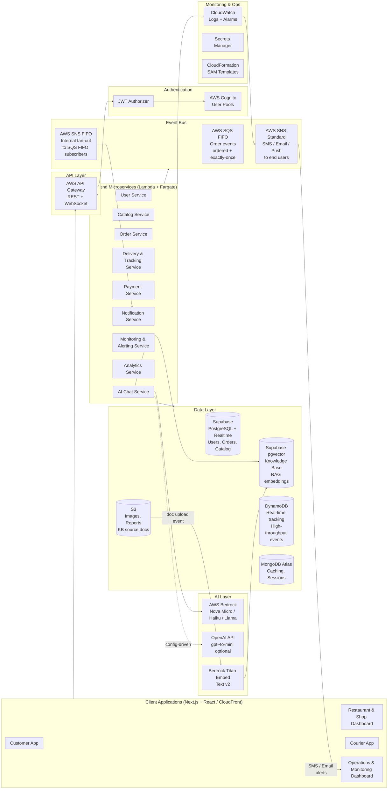
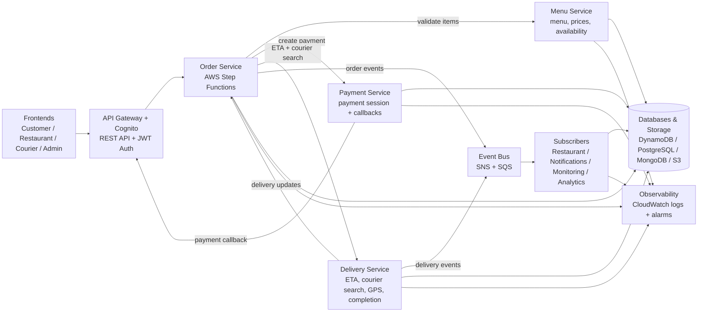
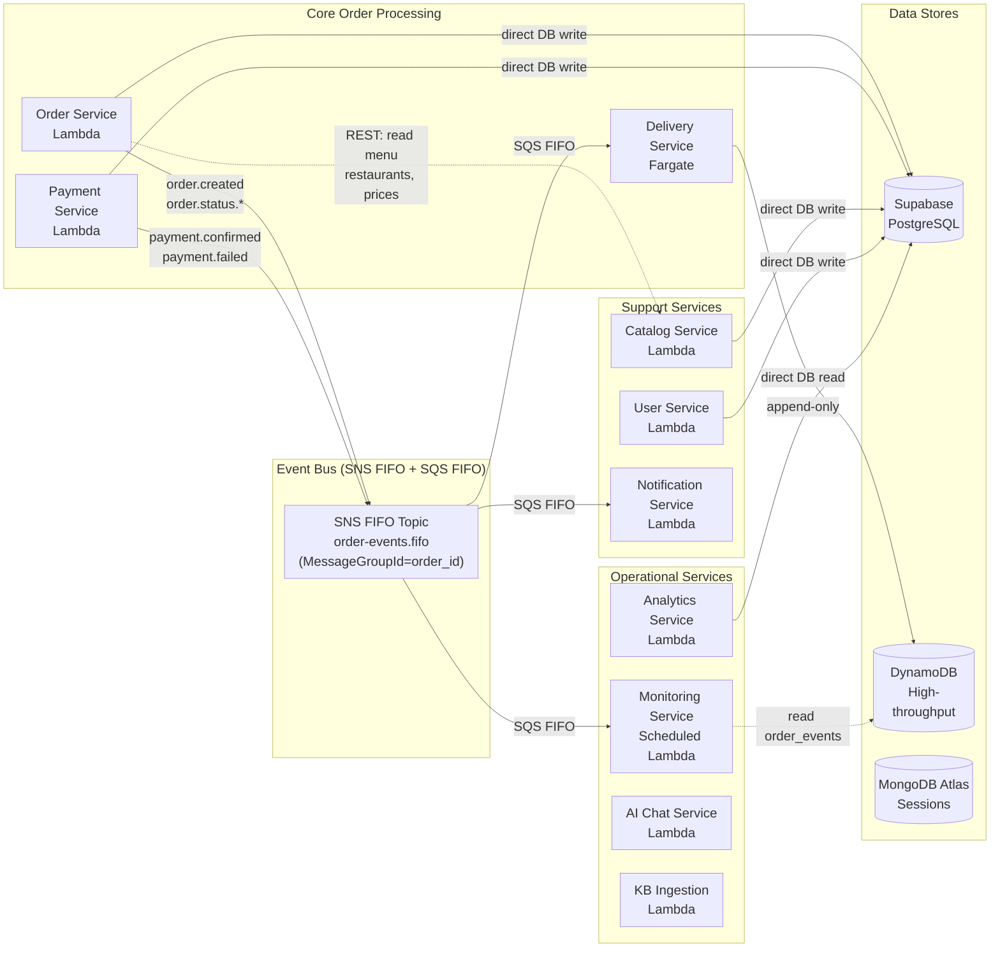
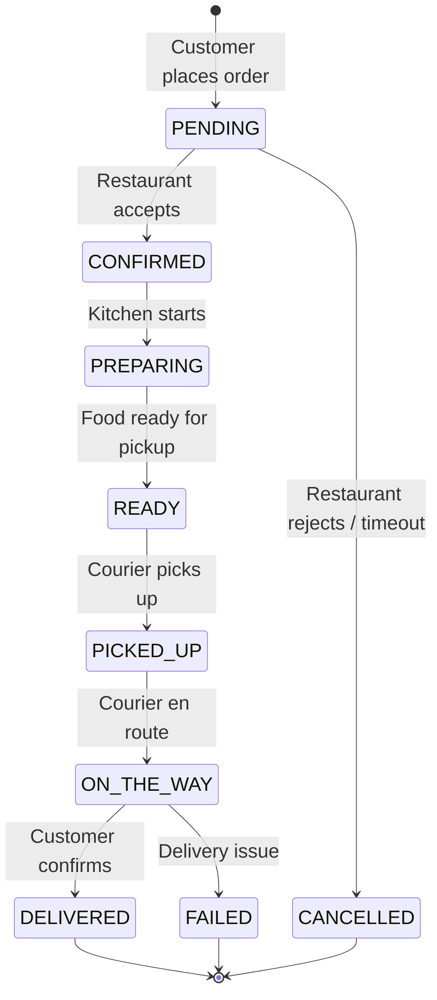
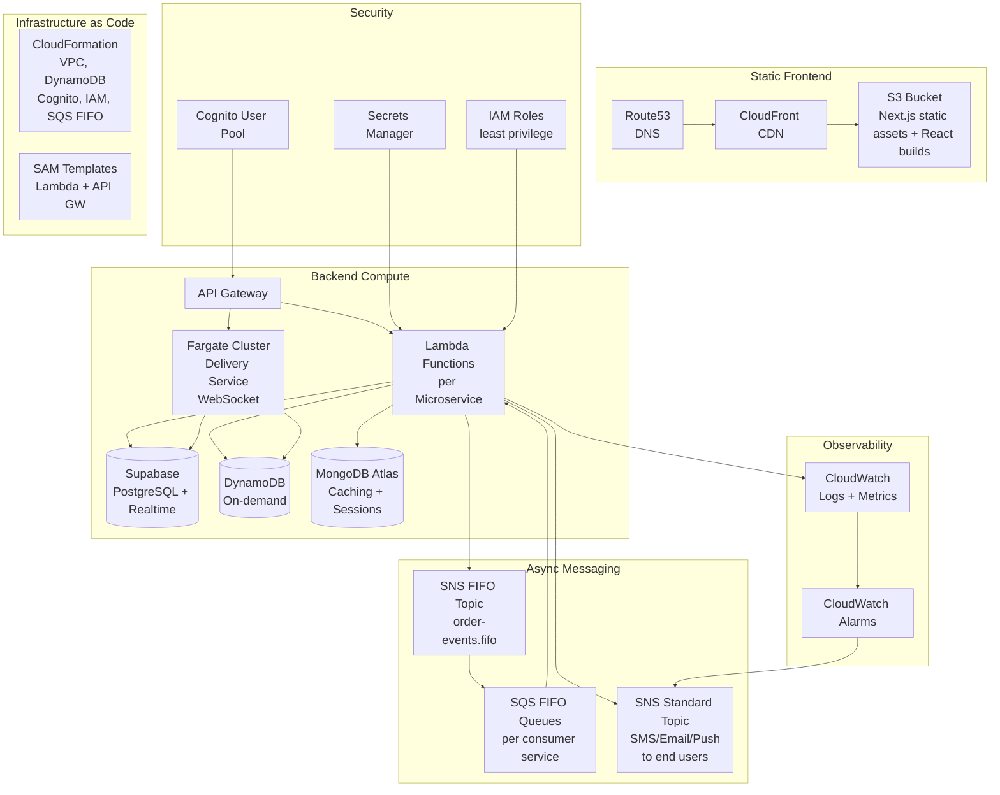
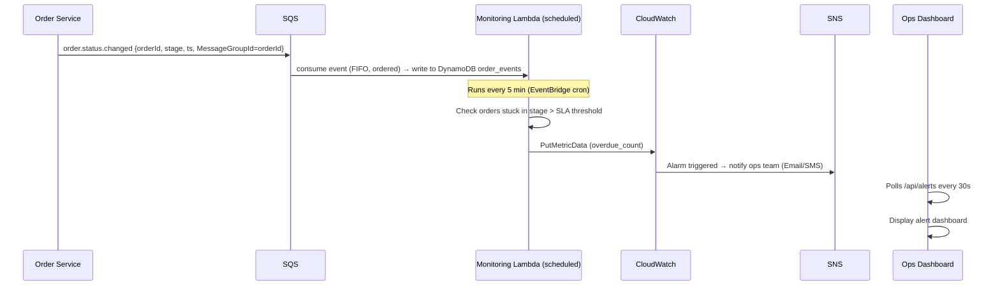
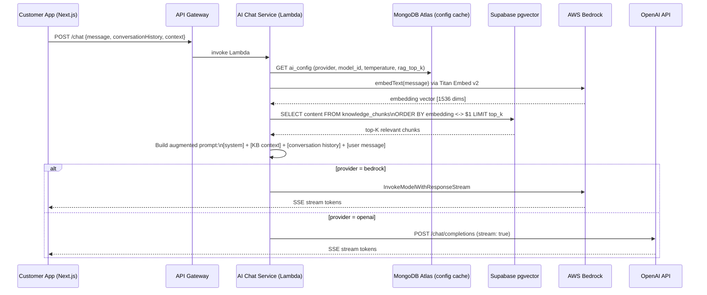
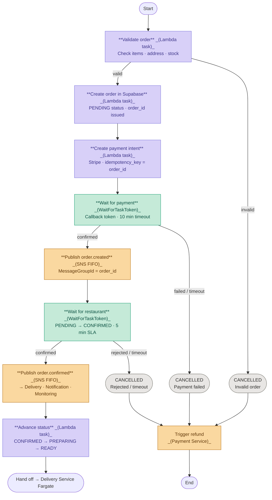
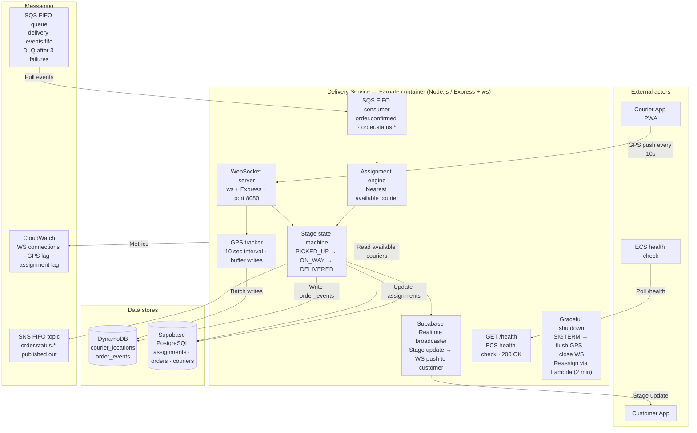

# Food Delivery Platform — High Level Architecture (HLA) + MVP Plan

**Scale:** ~100,000 users | 300 restaurants | 10,000 shops | 2,000 couriers  
**Stack:** Next.js (Customer Web) + React (Ops apps) · Node.js/FastAPI · AWS Lambda · Supabase (PostgreSQL + pgvector) · DynamoDB · MongoDB Atlas · AWS (Cognito, SQS FIFO, SNS FIFO, Bedrock, CloudWatch, Fargate, S3/CloudFront) · OpenAI API (optional)

---

## 1. System Overview

The platform covers the **full delivery lifecycle** with real-time monitoring of every stage:

```
Customer → Browse → Order → Payment → Preparation → Pickup → Delivery → Confirmed
                                  ↑ Every stage is tracked & monitored ↑
```

**Four client apps:**
| App | Users | Platform |
|---|---|---|
| Customer App | 100K end-users | Next.js (SSR/SSG, SEO-first) |
| Restaurant / Shop Dashboard | 300 restaurants + 10K shops | React |
| Courier App | 2,000 couriers | React PWA |
| Operations & Monitoring Dashboard | Admin / ops team | React |

---

## 2. High Level Architecture Diagram



---

## 2.1 Service Interaction & Request Flow

This diagram traces a live order request from client entry point through all service dependencies, showing synchronous calls, event publishing, and shared data/observability sinks.



**Key flows illustrated:**
- **Synchronous orchestration** (solid arrows): Order Service calls Menu Service to validate item availability and Payment Service to initiate checkout; Delivery Service feeds ETA and courier updates back into Order Service
- **Payment callback loop**: Payment provider posts confirmation back through API Gateway → Order Service state transition
- **Async fan-out** (Event Bus): Order and delivery events publish to SNS + SQS FIFO; independent subscriber services (Restaurant Dashboard, Notifications, Monitoring, Analytics) consume without blocking the critical path
- **Shared sinks**: All services write to the unified data layer and push metrics/logs to CloudWatch

---

## 3. Frontend Applications

### 3.1 Customer App (Next.js)

**Pages / Features:**
- SEO-first pages with SSR/SSG (home, cuisine/category, restaurant, item details)
- Login / Registration (Cognito Hosted UI or custom with JWT)
- Browse restaurants & shops (search, filter, category)
- Product catalog & cart
- Order placement & payment
- **Live order tracking** (WebSocket — real-time stage updates)
- Order history
- Profile & addresses
- **AI Chat widget** — floating assistant: order status Q&A, allergen/dietary queries, menu recommendations, support

### 3.2 Restaurant & Shop Dashboard (React)

**Pages / Features:**
- Login (role: `RESTAURANT` or `SHOP`)
- Incoming orders queue (real-time, WebSocket)
- Order acceptance / reject / ready status
- Menu management (CRUD)
- Availability toggle (open / closed)
- Sales reports (daily, weekly)

### 3.3 Courier App (React PWA)

**Pages / Features:**
- Login (role: `COURIER`)
- Available delivery tasks map
- Accept / decline task
- Stage updates: `PICKED_UP → ON_THE_WAY → DELIVERED`
- GPS location push (every 10 sec → DynamoDB)
- Earnings summary

### 3.4 Operations & Monitoring Dashboard (React)

**Pages / Features:**
- All active orders board (stage pipeline view)
- Alert inbox (CloudWatch → polling every 30 sec)
- SLA violations / overdue orders
- Courier map (live positions)
- User / restaurant / courier management (Admin role)
- System health metrics

---

## 4. Backend Microservices

### 4.1 Architecture Overview

The backend follows an **event-driven microservices** architecture with strict domain boundaries. Each service owns its data, exposes async-first APIs, and communicates via SNS FIFO + SQS FIFO to guarantee per-order event ordering. This eliminates tight coupling while maintaining transactional integrity for order workflows.



---

### 4.2 Service Catalog & Responsibilities

| Service | Domain | Responsibility | Runtime | Concurrency | API Type |
|---|---|---|---|---|---|
| **Order Service** | Order Processing | Order creation, state machine (PENDING→DELIVERED), event publishing | Lambda (Node.js) | 500–1000 concurrent | REST + SNS publisher |
| **Payment Service** | Payment | Idempotent payment intent creation, confirmation, refunds. Stripe/payment provider integration | Lambda (Node.js) | 100–200 concurrent | REST + SNS publisher |
| **Delivery Service** | Delivery Coordination | Courier assignment, real-time GPS tracking, stage updates (PICKED_UP→DELIVERED) | Fargate (persistent) | 5–10 tasks | WebSocket + SNS subscriber |
| **User Service** | Identity & Profile | User registration, authentication, profile/address management, role assignment | Lambda (Node.js) | 200–500 concurrent | REST |
| **Catalog Service** | Catalog | Menu/product CRUD, category management, availability toggles, search indexing | Lambda (Node.js) | 50–100 concurrent | REST + Supabase triggers |
| **Notification Service** | Notifications | Order status notifications (SMS/email/push via SNS Standard), template rendering | Lambda (Node.js) | 200–500 concurrent | SNS subscriber |
| **Monitoring Service** | Operations | SLA tracking, overdue order detection, alert generation (5-min schedule) | Scheduled Lambda | 1–2 concurrent | CloudWatch → SNS |
| **Analytics Service** | Business Intelligence | Daily/weekly aggregations, restaurant stats, order trends | Lambda (Python/FastAPI) | 10–50 concurrent | REST |
| **AI Chat Service** | Customer Support | RAG-powered Q&A, LLM routing (Bedrock/OpenAI) | Lambda (Node.js) | 50–100 concurrent | REST + SSE streaming |
| **KB Ingestion Service** | Knowledge Management | Document chunking (500-token windows), embedding generation, pgvector upsert | Lambda (Python) | 5–10 concurrent | SQS subscriber + S3 events |

---

### 4.3 Service Communication Patterns

#### Synchronous (REST) — Order-Independent Operations
- **User Service** ← Customer App (login, profile)
- **Catalog Service** ← Customer/Restaurant apps (browse menu, update availability)
- Used for **read-heavy** or **non-blocking** operations. No dependency on event ordering.

#### Asynchronous (SNS FIFO + SQS FIFO) — Order-Critical Events
- **Order Service** → SNS FIFO → **Delivery Service**, **Notification Service**, **Monitoring Service**
- **Why FIFO?** Per-order event ordering is **critical**: `PENDING→CONFIRMED→READY→PICKED_UP→DELIVERED` must process in strict sequence
- **MessageGroupId = order_id** ensures single-threaded processing per order
- **MessageDeduplicationId** (5-minute window) prevents duplicate event processing on retry

**Event Publishing Pattern:**
```
Order Service publishes event → SNS FIFO (single topic)
                            ↓
                    (fan-out via Subnodes)
                    ↙          ↓          ↘
            SQS FIFO (DS)  SQS FIFO (NS)  SQS FIFO (MS)
                ↓              ↓              ↓
         [Delivery Svc]  [Notification]  [Monitoring]
```

Each consumer (DS, NS, MS) operates independently without blocking others. Failure in one queue (e.g., Notification down) doesn't block Delivery or Monitoring.

---

### 4.4 Error Handling & Resilience

#### Timeouts & Circuit Breaking
| Service | Lambda Timeout | Retry Behavior | Circuit Breaker |
|---|---|---|---|
| Order Service | 30 sec | Exponential backoff (1s, 2s, 4s) on DB transient errors | N/A (Supabase is highly available) |
| Payment Service | 60 sec | Max 3 retries on network errors; fail-open on timeout (manual reconciliation queue) | Stripe API circuit breaker (fail-safe mode) |
| Delivery Service | 900 sec (Fargate) | N/A (persistent connection) | WebSocket reconnect logic every 10 sec |
| Notification Service | 60 sec | SNS Standard handles retries (max 15 minutes); DLQ captures permanent failures | SNS built-in retry policy |

#### Dead Letter Queues (DLQ)
- **SQS FIFO DLQ** attached to each consumer queue (DS, NS, MS)
- Messages that fail > 3 times go to DLQ for manual inspection
- Separate Lambda monitors DLQ and alerts ops on poison messages
- Example: corrupted event schema → moved to DLQ, doesn't block queue

#### Idempotency
- **Order Service**: Order creation is idempotent via `order_id` as deduplication key in Supabase
- **Payment Service**: Stripe `idempotency_key` prevents double-charging on retries
- **Notification Service**: Events tagged with unique `event_id` to skip duplicate sends
- All events include `timestamp` and `actor_id` for audit trail

---

### 4.5 Data Consistency & Transaction Handling

#### Strong Consistency (ACID) — Core Transactional Data
- **Supabase PostgreSQL**: users, orders, restaurants, menu_items
- Single-database ACID transactions within a service (no cross-service distributed transactions)
- Example: Order creation is atomic — either the entire order + order_items are created, or nothing

#### Eventual Consistency — Event-Driven Updates
- **Order status propagation**: Order Service writes to Supabase → publishes event → Monitoring/Notification services consume
- Clients may see stale order status for < 1 second before SNS FIFO delivery
- **Acceptable trade-off**: Real-time tracking is via Supabase Realtime (webhook), not polling

#### No Distributed Transactions
- **Why?** Synchronous 2PC across services is slow and brittle. Instead:
  - Order Service writes to DB + publishes event atomically
  - Consumers are responsible for idempotent processing of events
  - If a service crashes mid-processing, SQS retries the message

---

### 4.6 Scalability & Deployment

#### Lambda Concurrency Management
| Service | Baseline | Burst | Throttle Behavior |
|---|---|---|---|
| Order Service | 200 concurrent | 500 (lunch peak 12–14:00) | Queue incoming requests; alert ops if > 30 sec wait |
| Payment Service | 50 concurrent | 100 | Fail immediately if throttled (return 429 to client) |
| Delivery Service (Fargate) | 2–5 tasks | 10 tasks (lunch peak) | Auto-scale via ECS target tracking (CPU > 70%) |
| Notification Service | 200 concurrent | 500 | SNS handles queueing; Lambda processes from SQS |

#### Environment Promotion
- **Dev**: All services co-located in single AWS account, logging to CloudWatch Logs Insights
- **Staging**: Identical production stack; blue/green deployment via CloudFormation
- **Production**: Multi-AZ Fargate for Delivery Service; Lambda auto-replicated across AZs

#### CI/CD Pipeline
- GitHub Actions triggers on push to `main` branch
- SAM builds Lambda artifacts (Node.js/Python), unit tests run
- CloudFormation validates IaC templates
- Deploy to staging for smoke tests (e.g., place test order end-to-end)
- Manual approval for production deployment
- Rollback via CloudFormation stack update (previous template version)

---

### 4.7 Service Boundaries & Data Ownership

**Each service owns its data. No cross-service database writes.**

| Service | Owned Tables | External Dependencies |
|---|---|---|
| Order Service | `orders`, `order_items`, `order_status_history` | Reads: `menu_items`, `restaurants`, `payments` (via REST, cached) |
| Delivery Service | `assignments`, `courier_locations` (→ DynamoDB) | Reads: `orders`, `couriers` (via REST/cache) |
| Payment Service | `payments` | Reads: `orders` (via REST); writes event to SNS |
| Notification Service | `notification_log` (audit only) | Reads: `orders`, `users` (via REST) |
| User Service | `users`, `addresses`, `profiles` | N/A |
| Catalog Service | `menu_items`, `restaurants`, `categories` | N/A |

**API Versioning:**
- All REST endpoints prefixed with `/api/v1/`
- Breaking changes → `/api/v2/` (old version remains for backward compatibility for 6 months)
- Example: `/api/v1/orders` → new field added → `/api/v1/orders` (backward compatible) OR `/api/v2/orders` (if field removed)

---

### 4.8 Monitoring & Observability per Service

| Service | Key Metrics | Alert Threshold |
|---|---|---|
| Order Service | P99 latency, order creation errors, event publication lag | > 2 sec latency, > 5% error rate |
| Payment Service | Payment failures, Stripe API latency, idempotency key mismatches | > 100 failed payments/hour, > 30 sec latency |
| Delivery Service | WebSocket connection count, GPS update lag, courier assignment lag | Connection drops > 10%, GPS lag > 20 sec |
| Notification Service | Notification send failures, SMS delivery lag | > 1% failure rate, > 5 min delay |
| Monitoring Service | SLA violations detected, false-positive alerts | > 50 overdue orders, > 100 false alarms/day |

**CloudWatch Custom Metrics:**
- Each service publishes `ServiceName.OperationName.Duration` and `ServiceName.OperationName.ErrorCount`
- Example: `OrderService.CreateOrder.Duration` (histogram), `OrderService.CreateOrder.ErrorCount` (counter)
- Alarms trigger when error rate > threshold OR latency P99 > threshold for 5 consecutive minutes

---

### 4.9 API Contract & Request/Response Examples

#### Example: Order Service — POST /api/v1/orders

**Request:**
```json
{
  "customerId": "user-123",
  "restaurantId": "rest-456",
  "items": [
    { "menuItemId": "item-1", "quantity": 2, "specialInstructions": "no onions" }
  ],
  "deliveryAddressId": "addr-789",
  "estimatedDeliveryTime": "2026-06-23T19:00:00Z"
}
```

**Response (202 Accepted):**
```json
{
  "orderId": "order-xyz",
  "status": "PENDING",
  "createdAt": "2026-06-23T18:45:00Z",
  "restaurantConfirmationDeadline": "2026-06-23T18:50:00Z"
}
```

**On Error (400 Bad Request):**
```json
{
  "error": "UNAVAILABLE_ITEMS",
  "message": "Menu item item-1 is not available",
  "details": {
    "unavailableItems": ["item-1"]
  }
}
```

---

### 4.10 Service Lifecycle: Initialization & Shutdown

#### Initialization (Cold Start Optimization)
- **Lambda**: Node.js runtime pre-warmed via CloudWatch Events (ping every 5 min to keep warm)
  - Cold start ~500 ms (acceptable for MVP)
- **Fargate**: Services start within 30 sec; health check endpoint `/health` returns 200 when ready
- **Database connections**: Pooled via PgBouncer (Supabase managed); MongoDB Atlas connection pooling built-in

#### Graceful Shutdown (Fargate only)
- On ECS task termination, Delivery Service gets 30-second grace period (SIGTERM)
- Service flushes in-flight GPS updates to DynamoDB, closes WebSocket connections
- Active deliveries are reassigned via background Lambda (within 2 minutes)

---

### Service Responsibilities (Summary Table)

| Service | Responsibility | Runtime | Coupled To |
|---|---|---|---|
| **User Service** | Register, profile, address, roles | Lambda (Node.js) | Cognito, Supabase |
| **Catalog Service** | Menu, products, categories, availability | Lambda (Node.js) | Supabase, S3 (images) |
| **Order Service** | Order lifecycle state machine, event publishing | Lambda (Node.js) | Supabase, SNS FIFO, Stripe |
| **Delivery Service** | Courier assignment, GPS tracking, stage updates | Fargate (persistent WebSocket) | DynamoDB, Supabase Realtime, SNS FIFO |
| **Payment Service** | Payment intent, confirm, refund | Lambda (Node.js) | Stripe API, SNS FIFO |
| **Notification Service** | Push / SMS / email via SNS | Lambda (Node.js) | SNS Standard, SQS FIFO |
| **Monitoring Service** | Check stage SLAs, alert on overdue orders | Scheduled Lambda | DynamoDB, CloudWatch, SNS |
| **Analytics Service** | Reports, aggregations | Lambda (Python/FastAPI) | Supabase, MongoDB Atlas |
| **AI Chat Service** | RAG retrieval + LLM routing (Bedrock/OpenAI) | Lambda (Node.js) | Bedrock, OpenAI, Supabase pgvector, MongoDB Atlas |
| **KB Ingestion Service** | Chunk, embed, upsert docs to pgvector | Lambda (Python) | S3, Bedrock Embed, Supabase pgvector |

---

## 5. Order State Machine (Core Business Logic)



**Every transition** → SNS FIFO topic → fan-out to SQS FIFO queues → triggers Notification + Monitoring services. Order ID used as **MessageGroupId** — guarantees per-order event ordering.

---

## 6. Data Layer Design

### Supabase (PostgreSQL + Realtime — structured relational data)
```
users            (id, email, phone, role, cognito_sub, created_at)
restaurants      (id, name, owner_id, address, is_open, rating)
menu_items       (id, restaurant_id, name, price, category, image_url)
orders           (id, customer_id, restaurant_id, status, total, created_at)
order_items      (id, order_id, menu_item_id, qty, price)
couriers         (id, user_id, vehicle_type, is_available)
payments         (id, order_id, provider_ref, status, amount)
```
> Supabase **Realtime** (PostgreSQL logical replication → WebSocket) pushes order status changes directly to subscribed clients — replaces a custom WebSocket layer for order tracking.

### DynamoDB (high-throughput append-only data)
```
courier_locations    PK: courier_id   SK: timestamp   (lat, lng, order_id)
order_events         PK: order_id     SK: event_time  (stage, actor_id)
                     ↳ Immutable audit log: every order state transition (PENDING→CONFIRMED→READY→PICKED_UP→DELIVERED)
                     ↳ actor_id: the user/system that triggered the event
                       • restaurant_id when PENDING→CONFIRMED (restaurant accepts)
                       • "SYSTEM" when CONFIRMED→PREPARING (auto-start after delay)
                       • courier_id when READY→PICKED_UP (courier picks up food)
                       • courier_id when PICKED_UP→ON_THE_WAY (courier en route)
                       • customer_id when ON_THE_WAY→DELIVERED (customer confirms)
                     ↳ Why store here? Immutable event log for compliance, analytics, and debugging delivery issues
```
> DynamoDB is kept only for GPS writes (10K+ writes/min) and the immutable event log — both are append-only, schema-less, and require single-digit ms writes.

### MongoDB Atlas (caching + sessions — document store)
```
Collection: catalog_cache    { restaurant_id, menu_items[], ttl: 5min }
Collection: sessions         { user_id, jwt_meta, expires_at (TTL index) }
                             ↳ Stores JWT metadata + session state for every authenticated user
                             ↳ Why store here? Fast session lookup on every API request (avoid DB hits)
                             ↳ TTL index automatically deletes expired sessions (self-cleaning, no manual cleanup)
                             ↳ Example: on login, Cognito returns JWT → store jwt_meta in MongoDB for 1h
                               (then subsequent API calls validate session locally before hitting Supabase)
                             ↳ Replaces Redis sessions — no separate caching infrastructure needed
Collection: active_orders    { order_id, status, last_updated, courier_pos }
```
> TTL indexes on MongoDB collections provide automatic expiry — equivalent to Redis TTL without a separate caching service. Change Streams can be used for lightweight pub/sub where sub-millisecond latency is not required.

---

## 7. AWS Infrastructure Diagram



---

## 8. Security Design

```
Authentication:  AWS Cognito → JWT (access token 1h, refresh token 30d)
Authorization:   Role-based: CUSTOMER | RESTAURANT | SHOP | COURIER | ADMIN | OPS
Transport:       HTTPS only (CloudFront enforced)
Secrets:         AWS Secrets Manager (DB creds, payment keys, API keys)
Config:          Environment variables for non-sensitive (LOG_LEVEL, REGION)
IAM:             Each Lambda has minimal role (least privilege)
Input:           Validation on API Gateway + service layer (Zod / Joi)
```

---

## 9. Monitoring Architecture (Stage Tracking)



**SLA Thresholds (configurable per stage):**
| Stage | SLA |
|---|---|
| PENDING → CONFIRMED | 5 min |
| CONFIRMED → READY | 30 min |
| READY → PICKED_UP | 15 min |
| PICKED_UP → DELIVERED | 60 min |

---

## 10. Tech Stack — Economic Justification

### Why AWS Lambda for Microservices?
- **Cost:** Pay-per-invocation. At 100K users, NOT all active simultaneously → massive savings vs. always-on servers
- **Scale:** Auto-scales to zero and to thousands. Handles lunch peak (12–14:00) automatically
- **Ops:** No server management → 3 engineers focus on features, not infrastructure

### Why Fargate for Delivery Service?
- Delivery tracking needs **persistent WebSocket connections** (Lambda has 29-sec timeout)
- Fargate allows long-lived containers without managing EC2 instances

### Why Supabase (instead of raw RDS)?
- Same PostgreSQL under the hood — all relational, ACID-compliant guarantees
- **Built-in Realtime**: order status changes push to clients via WebSocket out-of-the-box (no extra Socket.io server needed)
- **Auto-generated REST API**: reduces boilerplate in catalog/user services
- **Managed service**: no RDS Multi-AZ setup, connection pooling (PgBouncer) is built-in
- **Cost**: Supabase Pro plan ($25/mo) vs RDS db.t3.medium Multi-AZ ($120–160/mo) → **saves ~$100–130/mo at MVP stage**

### Why DynamoDB?
- Courier GPS updates = **10,000+ writes/min** at peak → DynamoDB handles this at single-digit milliseconds
- Order events log = append-only, schema-less → perfect DynamoDB fit

### Why MongoDB Atlas (instead of ElastiCache Redis)?
- **TTL collections** replace Redis key expiry for catalog cache and sessions — no separate caching infrastructure
- **Document model** fits catalog cache naturally (restaurant + full menu in one document)
- **Change Streams** provide lightweight pub/sub for cases where sub-millisecond latency is not needed
- **Atlas Free Tier (M0)** for MVP → $0 until scale demands M10 ($57/mo)
- **Limitation acknowledged**: MongoDB is NOT a drop-in replacement for Redis pub/sub at very high frequency. Courier GPS broadcast (every 10 sec, 2K couriers) is handled by **Supabase Realtime** (Postgres → WebSocket) instead — not MongoDB

### Why Next.js for Customer + React for dashboards/PWA?
- Customer App gets SSR/SSG for SEO-critical discovery pages (landing, cuisine, restaurant)
- React remains optimal for back-office dashboards and courier PWA workflows
- PWA capability is preserved where mobile-installable behavior is needed (Courier App)
- Team can share UI components across Next.js and React apps using a common package

### Why AWS Bedrock + pgvector RAG?
- **Bedrock**: no separate AI infrastructure — same AWS account, IAM-controlled, no API key rotation for internal models
- **Multiple model options** give admin flexibility without code changes — just update `ai_config` in Supabase
- **Amazon Nova Micro** ($0.035/1M input tokens) is the cheapest viable LLM for simple Q&A — 10× cheaper than GPT-4o
- **pgvector in Supabase** = zero extra infrastructure for vector search — the PostgreSQL extension is already there
- **Titan Embed Text v2** ($0.02/1M tokens) for embeddings — cheapest embedding model on Bedrock
- **Continuous KB update**: S3 upload triggers ingestion Lambda automatically — no manual steps
- **OpenAI API** remains as a configurable fallback — useful when GPT-4o-mini quality is needed at minimal cost ($0.15/1M input)

### Why SQS FIFO + SNS FIFO for order events?
- **FIFO = ordering guaranteed per order**: `MessageGroupId = order_id` ensures CONFIRMED always processes before PREPARING, PREPARING before READY — critical for the state machine
- **Exactly-once processing**: SQS FIFO deduplicates within a 5-minute window using `MessageDeduplicationId`
- **SNS FIFO fan-out**: single `order-events.fifo` topic fans out to multiple SQS FIFO queues (one per consumer: Notification, Monitoring, Delivery) — all receive ordered events independently
- **Standard SNS** is kept for final user notifications (SMS/email) since SNS FIFO cannot deliver to phone/email endpoints directly
- **Throughput**: SQS FIFO supports 3,000 TPS with batching — more than sufficient for 100K users
- **DLQ**: Dead Letter Queue on each SQS FIFO queue catches poison messages without blocking the queue

### Total Monthly Cost Estimate (MVP scale, 100K users)
| Component | Est. Cost/Month |
|---|---|
| Lambda (order/catalog/user) | $15–30 |
| Fargate (2 tasks, delivery service) | $50–80 |
| Supabase Pro (PostgreSQL + Realtime) | $25–50 |
| DynamoDB (on-demand) | $20–50 |
| MongoDB Atlas (M0 free → M10) | $0–57 |
| API Gateway | $10–20 |
| CloudFront + S3 | $10–20 |
| SQS FIFO + SNS FIFO + SNS Standard | $5–12 |
| CloudWatch | $10–15 |
| Cognito (first 50K MAU free) | $0–27 |
| **AI: AWS Bedrock LLM** (Nova Micro, ~1M tokens/mo) | $1–15 |
| **AI: Bedrock Titan Embed v2** (ingestion + queries) | $1–5 |
| **AI: OpenAI API** (optional, if admin switches) | $0–30 |
| **TOTAL** | **~$147–465/mo** |

> **vs optional stack**: Replacing RDS Multi-AZ ($120–160) with Supabase Pro ($25–50) and ElastiCache Redis ($25–40) with MongoDB Atlas Free Tier ($0) saves **$100–175/mo** at MVP stage. AI adds only **$2–50/mo** at MVP usage levels — pgvector reuses existing Supabase Pro plan at no extra cost.

---

## 11. Two-Week Development Plan — 3 Senior Engineers

### Team Roles
- **Engineer A** — Backend (Node.js), Order/Payment/Auth services
- **Engineer B** — Backend (Node.js), Catalog/Delivery/Notification services  
- **Engineer C** — Frontend (Next.js + React), all 4 applications + AWS IaC setup

---

### Week 1 — Foundation & Core Services

| Day | Engineer A | Engineer B | Engineer C |
|---|---|---|---|
| **1** | AWS setup: Cognito, DynamoDB, SQS FIFO queues + SNS FIFO topic, Supabase project init | AWS setup: Fargate cluster, API Gateway, MongoDB Atlas cluster, CloudFormation templates | Project scaffold: 1 Next.js app (Customer) + 3 React apps, CloudFront pipeline, routing |
| **2** | User Service: register, login, JWT, roles (Lambda + Supabase) | Catalog Service: restaurants/menus CRUD (Lambda + Supabase) | Customer App: Login page, JWT storage, protected routes |
| **3** | Order Service: create order, state machine (PENDING→CONFIRMED→PREPARING) | Catalog Service: product images (S3), search/filter endpoints | Restaurant Dashboard: Login, order queue (polling), order accept/reject |
| **4** | Order Service: full state machine + SQS event publishing | Delivery Service: Fargate container, WebSocket, courier assignment | Customer App: Browse, cart, order placement flow |
| **5** | Payment Service: Stripe/payment intent Lambda, confirm/refund | Notification Service: SNS fan-out (Email+SMS), push skeleton | Restaurant Dashboard: Menu management CRUD |

### Week 2 — Tracking, Monitoring, Polish, Deploy

| Day | Engineer A | Engineer B | Engineer C |
|---|---|---|---|
| **8** | Monitoring Service: scheduled Lambda, SLA checks, CloudWatch alarms | Delivery Service: GPS tracking → DynamoDB, Supabase Realtime broadcast to clients | Courier App: Login, task list, accept delivery, stage updates |
| **9** | Monitoring Service: alert polling endpoint (`GET /alerts`) | Analytics Service: daily orders report, restaurant stats | Customer App: Live order tracking (WebSocket), order history |
| **10** | Auth: Cognito integration polish, token refresh, RBAC middleware | Notification Service: full integration — every stage triggers correct notification | Ops Dashboard: Alert inbox (30s poll), all-orders board, SLA indicator |
| **11** | End-to-end testing: full order flow Customer→Restaurant→Courier→Delivered | End-to-end testing: notifications, delivery tracking, analytics | Ops Dashboard: Courier live map (positions from Supabase Realtime), admin user management |
| **12** | SAM templates: all Lambdas + API Gateway deployment | CloudFormation: full infra stack (DynamoDB, SQS FIFO, SNS FIFO, Cognito, IAM) | Cross-browser testing, mobile layout polish, environment configs |
| **13** | Integration testing, bug fixes, secrets config (Secrets Manager) | Load test: SQS throughput, DynamoDB GPS writes | CI/CD pipeline (GitHub Actions → S3 + Lambda deploy) |
| **14** | **MVP Demo Prep + Documentation** | **MVP Demo Prep + Documentation** | **MVP Demo Prep + Staging Deploy** |

---

### Deliverables After 2 Weeks
- [ ] Customer app (Next.js) + 3 React apps deployed via CloudFront
- [ ] 7 Lambda microservices deployed (SAM)
- [ ] Delivery service on Fargate (WebSocket live tracking)
- [ ] Full order lifecycle (PENDING → DELIVERED) working end-to-end
- [ ] Monitoring dashboard with real-time alerts
- [ ] CloudFormation IaC for full infrastructure
- [ ] Cognito Auth + RBAC for all roles
- [ ] Notification (Email + SMS) on every stage
- [ ] CI/CD pipeline for automated deployment
- [ ] AI Chat widget functional in Customer App only (Bedrock default model)
- [ ] RAG knowledge base seeded with FAQ + restaurant data
- [ ] KB ingestion pipeline (S3 → embed → pgvector) operational

---

## 12. Project Structure (Monorepo)

```
food-delivery/
├── infrastructure/
│   ├── cloudformation/       # VPC, DynamoDB, SQS FIFO, SNS FIFO, Cognito stacks
│   └── sam/                  # SAM templates per Lambda service
│
├── services/
│   ├── user-service/         # Node.js Lambda
│   ├── catalog-service/      # Node.js Lambda
│   ├── order-service/        # Node.js Lambda
│   ├── delivery-service/     # Node.js Fargate (Express + ws)
│   ├── payment-service/      # Node.js Lambda
│   ├── notification-service/ # Node.js Lambda
│   ├── monitoring-service/   # Node.js Scheduled Lambda
│   ├── analytics-service/    # Python FastAPI Lambda
│   ├── ai-chat-service/      # Node.js Lambda (Bedrock/OpenAI router + RAG)
│   └── kb-ingestion-service/ # Python Lambda (chunk → embed → pgvector upsert)
│
├── frontend/
│   ├── customer-app/         # Next.js (SSR/SSG for SEO)
│   ├── restaurant-dashboard/ # React
│   ├── courier-app/          # React PWA
│   └── ops-dashboard/        # React
│
└── shared/
    ├── types/                # Shared TypeScript types
    ├── events/               # SQS event schemas
    ├── middleware/           # JWT validation, error handler
    └── ai/                   # Bedrock/OpenAI client wrappers, prompt templates
```

---

## 13. Customer App AI Chat & RAG Architecture

### 13.1 Overview

The Customer App exposes a **floating chat widget** (React component). Messages are sent to the **AI Chat Service** (Lambda), which:
1. Loads the active LLM config from MongoDB Atlas cache
2. Embeds the user query via **Bedrock Titan Embed Text v2**
3. Runs a **pgvector similarity search** on Supabase knowledge base (RAG)
4. Augments the prompt with top-K retrieved chunks
5. Calls the configured LLM (Bedrock or OpenAI)
6. Streams the response back to the client via **Server-Sent Events (SSE)**

---

### 13.2 AI Chat Request Flow



---

### 13.3 Available LLM Models

| Model | Provider | Input $/1M tokens | Output $/1M tokens | Best For |
|---|---|---|---|---|
| **Amazon Nova Micro** | Bedrock | $0.035 | $0.14 | Simple Q&A, FAQ, routing (cheapest) |
| Amazon Nova Lite | Bedrock | $0.06 | $0.24 | Balanced speed + quality |
| Claude Haiku 3.5 | Bedrock | $0.80 | $4.00 | Complex reasoning, multi-step |
| Llama 3.1 8B Instruct | Bedrock | $0.22 | $0.22 | Open source, no data leaves AWS |
| Mistral Small | Bedrock | $0.60 | $0.60 | European data regulations |
| **GPT-4o Mini** | OpenAI API | $0.15 | $0.60 | Best quality/price, external API |
| GPT-3.5 Turbo | OpenAI API | $0.50 | $1.50 | Legacy fallback |

> **Recommended default**: Amazon Nova Micro — 10× cheaper than GPT-4o for standard Q&A at MVP scale. The fallback model can be changed in configuration when needed.

---

### 13.4 AI Config (stored in Supabase)

```sql
CREATE TABLE ai_config (
  id           uuid PRIMARY KEY DEFAULT gen_random_uuid(),
  provider     text NOT NULL CHECK (provider IN ('bedrock', 'openai')),
  model_id     text NOT NULL,   -- e.g. 'amazon.nova-micro-v1:0' or 'gpt-4o-mini'
  temperature  float DEFAULT 0.7,
  max_tokens   int   DEFAULT 600,
  rag_enabled  bool  DEFAULT true,
  rag_top_k    int   DEFAULT 5,
  updated_at   timestamptz DEFAULT now(),
  updated_by   uuid REFERENCES users(id)
);
```

Config is cached in **MongoDB Atlas** (TTL 60s) so every Lambda invocation doesn't hit Supabase on each request. Config changes propagate within 1 minute.

API keys are stored in **AWS Secrets Manager** (`/food-delivery/openai-api-key`), not in the config table.

---

### 13.5 RAG Knowledge Base — Schema (Supabase pgvector)

```sql
-- Enable pgvector extension (one-time)
CREATE EXTENSION IF NOT EXISTS vector;

CREATE TABLE knowledge_chunks (
  id          uuid PRIMARY KEY DEFAULT gen_random_uuid(),
  content     text NOT NULL,                        -- raw chunk text
  embedding   vector(1536),                         -- Titan Embed v2 output
  source_type text NOT NULL,                        -- 'faq' | 'menu' | 'policy' | 'restaurant_info' | 'guide'
  source_id   text,                                 -- restaurant_id, doc filename, etc.
  metadata    jsonb DEFAULT '{}',                   -- tags, language, version
  created_at  timestamptz DEFAULT now(),
  updated_at  timestamptz DEFAULT now()
);

-- HNSW index for fast ANN search
CREATE INDEX ON knowledge_chunks
  USING hnsw (embedding vector_cosine_ops)
  WITH (m = 16, ef_construction = 64);
```

**Knowledge base content types:**
| `source_type` | Content | Update Trigger |
|---|---|---|
| `faq` | Delivery times, refund policy, payment Q&A | Manual upload via knowledge base pipeline |
| `menu` | All restaurant menus + item descriptions | Auto: menu update in Catalog Service |
| `policy` | Courier policy, operational procedures | Manual upload |
| `restaurant_info` | Restaurant descriptions, hours, cuisine types | Auto: restaurant profile update |
| `guide` | How-to guides for all user roles | Manual upload |

---

### 13.6 KB Ingestion Pipeline (Continuous Updates)


**Chunking strategy:**
- Chunk size: **500 tokens**, overlap: **50 tokens** (sliding window)
- Each chunk tagged with `source_type` + `source_id` for targeted re-ingestion
- On menu update: delete existing chunks where `source_id = restaurant_id` AND `source_type = 'menu'`, then re-ingest

---

### 13.7 Chat Widget (React Component)

```
<AIChatWidget
    context={{ orderId?, restaurantId?, role: 'CUSTOMER' }}
  endpoint="/api/chat"
  streaming={true}
  placeholder="Ask anything..."
/>
```

- **Floating button** in bottom-right corner of the Customer App
- Opens a **slide-in panel** with conversation history
- Uses `EventSource` API for SSE streaming (tokens appear word-by-word)
- Conversation history stored in component state (not persisted — privacy-friendly)
- Customer-aware: system prompt varies by order context, dietary preferences, and support needs


--- 	


## 14. Order Service — AWS Step Functions State Machine

### 14.1 Overview

The Order Service Lambda is orchestrated by an **AWS Step Functions Express Workflow**. Using a state machine replaces the ad-hoc chaining of Lambda invocations with an explicit, auditable, and retriable flow. Every state transition is logged to CloudWatch, giving the ops team full visibility without custom instrumentation.

Key design decisions:

- **`WaitForTaskToken` at payment and restaurant confirmation steps** — the state machine pauses and issues a callback token to the external actor (Stripe webhook → Payment Service, restaurant dashboard → Order Service API). This costs zero Lambda-seconds while waiting, versus a polling loop that would burn continuous invocations.
- **Per-order `MessageGroupId`** on every SNS FIFO publish ensures downstream services (Delivery, Notification, Monitoring) receive events in strict causal order: `PENDING → CONFIRMED → PREPARING → READY`.
- **Three distinct `CANCELLED` terminal paths** (validation failure, payment failure, restaurant rejection/timeout) each trigger a shared refund flow via the Payment Service before terminating.
- **Idempotency** is enforced at the `Create order in Supabase` step using `order_id` as the deduplication key, so retries on transient DB errors never create duplicate orders.

### 14.2 State Machine Diagram



**Node legend:**

| Color | Type | Examples |
|---|---|---|
| Purple | Lambda task | Validate, Create order, Advance status |
| Green | Wait / Choice (WaitForTaskToken) | Wait for payment, Wait for restaurant |
| Amber | SNS FIFO publish | order.created, order.confirmed |
| Gray | Terminal state | CANCELLED × 3, End |

### 14.3 State Timeouts & Retry Policy

| State | Timeout | Retry | On failure |
|---|---|---|---|
| Validate order | 5 sec | 3× exponential (1s, 2s, 4s) | → CANCELLED (invalid) |
| Create payment intent | 30 sec | 3× exponential | → CANCELLED (payment) |
| Wait for payment | 10 min | N/A (external callback) | → CANCELLED (payment) |
| Wait for restaurant | 5 min | N/A (external callback) | → CANCELLED (rejected) |
| Publish SNS FIFO | 10 sec | 3× exponential | Step Functions retries, DLQ on exhaustion |
| Advance status | 15 sec | 3× exponential | CloudWatch alarm, manual retry via ops |

---

## 15. Delivery Service — Fargate Architecture

### 15.1 Why Fargate

The Delivery Service is the only backend component running on Fargate rather than Lambda. Three hard constraints force this choice:

1. **Persistent WebSocket connections** — couriers push GPS every 10 seconds; customers hold a live tracking connection. Lambda's maximum 29-second execution timeout cannot support either.
2. **Stateful in-memory routing** — the Assignment Engine keeps a small in-process map of `courier_id → current_order` to avoid a database round-trip on every GPS event. Lambda's stateless cold-start model makes this prohibitively expensive.
3. **Graceful shutdown with active deliveries** — on ECS task termination (SIGTERM), the service must flush in-flight GPS writes to DynamoDB and reassign any active couriers before exiting. A 30-second grace period is required; Lambda does not support this.

### 15.2 Internal Module Diagram



### 15.3 Module Responsibilities

| Module | Responsibility | Trigger |
|---|---|---|
| **WebSocket server** | Accepts persistent connections from couriers and (indirectly) customer apps; routes inbound GPS frames to GPS Tracker and stage commands to Stage State Machine | New WS connection on port 8080 |
| **Assignment engine** | On `order.confirmed` event, queries Supabase for the nearest available courier, writes to `assignments`, notifies courier via WS | SQS FIFO consumer delivers `order.confirmed` |
| **GPS tracker** | Buffers GPS frames from couriers (10 sec cadence, 2,000 couriers = ~200 writes/sec peak), batch-writes to DynamoDB `courier_locations` | Courier WS message |
| **Stage state machine** | Authoritative source for `PICKED_UP → ON_THE_WAY → DELIVERED` transitions; each transition writes to DynamoDB `order_events`, updates Supabase `assignments`, and publishes to SNS FIFO | Courier stage-update WS message |
| **SQS FIFO consumer** | Long-polls `delivery-events.fifo`; routes `order.confirmed` to Assignment Engine and other order events to Stage State Machine | SQS FIFO queue |
| **Supabase Realtime broadcaster** | On each stage transition, writes to Supabase `orders.status`; Supabase Realtime (PostgreSQL logical replication → WebSocket) pushes update to subscribed Customer App instances | Stage state machine transition |
| **GET /health** | Returns `200 OK` when all internal modules are initialised; used by ECS target group health check to gate traffic | ECS health check (every 30 sec) |
| **Graceful shutdown** | On SIGTERM: stops accepting new WS connections, flushes GPS write buffer to DynamoDB, closes active WS connections, invokes reassignment Lambda for any in-progress deliveries | ECS task termination (SIGTERM) |

### 15.4 Scaling & Resilience

**ECS auto-scaling** uses CPU target tracking (threshold: 70%):

| Time | Task count | Driver |
|---|---|---|
| Off-peak | 2 tasks | Baseline minimum |
| Lunch peak (12–14:00) | Up to 10 tasks | CPU > 70% for 3 consecutive minutes |
| Scale-in | Back to 2 | CPU < 50% for 15 minutes (cooldown) |

**Connection draining:** When ECS terminates a task, it deregisters the task from the load balancer target group with a 30-second connection-draining window. The graceful shutdown handler inside the container uses this window to complete in-flight GPS writes and trigger courier reassignment via an async Lambda invocation.

**DLQ:** The SQS FIFO consumer queue (`delivery-events.fifo`) has a Dead Letter Queue. Messages that fail processing more than 3 times are moved to the DLQ and trigger a CloudWatch alarm to the ops team — they never block the queue.

**CloudWatch key metrics for Delivery Service:**

| Metric | Alert threshold |
|---|---|
| WebSocket connection count | Drop > 10% in 5 min |
| GPS update lag (DynamoDB write delay) | > 20 seconds |
| Courier assignment lag (order.confirmed → courier notified) | > 30 seconds |
| Active task count below minimum | < 2 tasks for > 2 min |
