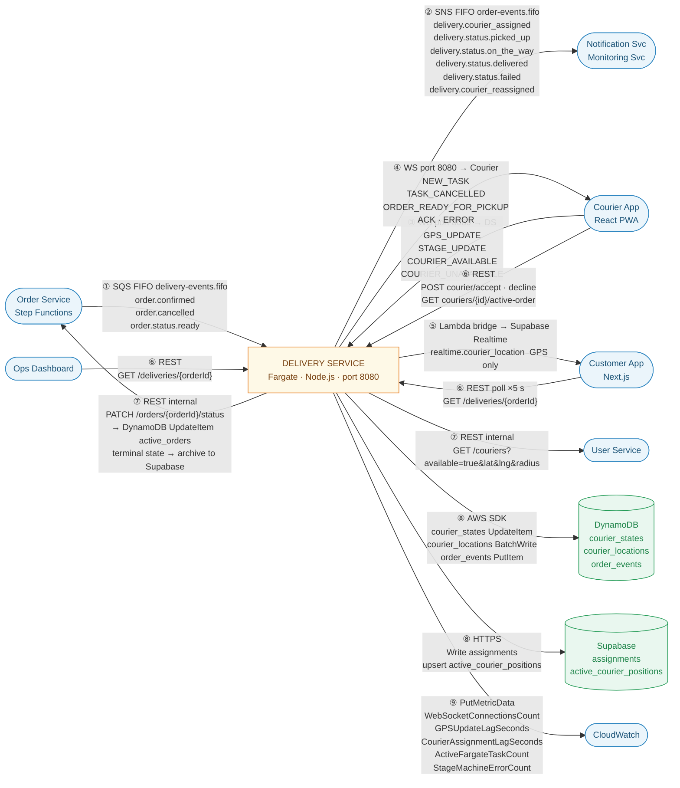

# Delivery Service — Inter-Service Message Contracts

**Service:** `delivery-service`  
**Runtime:** Node.js / Fargate (Express + ws, port 8080)

---

## Channel Overview

| # | Channel | Direction | Transport |
|---|---------|-----------|-----------|
| 1 | [SQS FIFO Inbound](#1-sqs-fifo-inbound) | → Delivery Service | SQS FIFO `delivery-events.fifo` |
| 2 | [SNS FIFO Outbound](#2-sns-fifo-outbound) | Delivery Service → | SNS FIFO `order-events.fifo` |
| 3 | [WebSocket Inbound](#3-websocket-inbound--courier-app--delivery-service) | Courier App → Delivery Service | WebSocket port 8080 |
| 4 | [WebSocket Outbound → Courier](#4-websocket-outbound--delivery-service--courier-app) | Delivery Service → Courier App | WebSocket port 8080 |
| 5 | [Supabase Realtime Outbound → Customer](#5-supabase-realtime-outbound--delivery-service--customer-app) | Delivery Service → Customer App | Supabase Realtime (GPS only) |
| 6 | [REST Inbound](#6-rest-api-inbound) | Clients → Delivery Service | API Gateway / HTTPS |
| 7 | [REST Outbound](#7-rest-api-outbound) | Delivery Service → Services | Internal HTTPS |
| 8 | [DynamoDB Writes](#8-dynamodb-write-shapes) | Delivery Service → DynamoDB | AWS SDK |
| 9 | [CloudWatch Metrics](#9-cloudwatch-custom-metrics) | Delivery Service → CloudWatch | PutMetricData |

---

## Message Flow Overview



> Arrow numbers correspond to Channel Overview rows. `DS` ↔ `CA` has arrows in both directions — Courier App is both a WebSocket sender (Ch.3) and receiver (Ch.4) and a REST caller (Ch.6). `DS` ↔ `OS` is bidirectional — Order Service pushes SQS events in (Ch.1) and receives REST status patches out (Ch.7).

---

## 1. SQS FIFO Inbound

> Messages consumed from the `delivery-events.fifo` queue.  
> `MessageGroupId = order_id` on all messages — guarantees per-order event ordering.  
> Dead Letter Queue (DLQ) triggers after **3 consecutive processing failures**.

---

### `order.confirmed`

Published by **Order Service** (Step Functions) via SNS FIFO → SQS FIFO fan-out. Triggers the courier **Assignment Engine**.

| Field | Value |
|-------|-------|
| `MessageGroupId` | `order_id` *(runtime value)* |
| `MessageDeduplicationId` | `order_id + ':confirmed'` |

```json
{
  "eventType": "order.confirmed",
  "eventId": "evt_01J0XYZ1234ABCD",
  "timestamp": "2026-06-23T18:50:00.000Z",
  "orderId": "order-xyz",
  "customerId": "user-123",
  "restaurantId": "rest-456",
  "restaurantAddress": {
    "lat": 32.0853,
    "lng": 34.7818,
    "street": "Rothschild Blvd 1",
    "city": "Tel Aviv"
  },
  "deliveryAddress": {
    "addressId": "addr-789",
    "lat": 32.0742,
    "lng": 34.7922,
    "street": "Ben Yehuda St 44",
    "city": "Tel Aviv"
  },
  "estimatedPickupTime": "2026-06-23T19:05:00.000Z",
  "estimatedDeliveryTime": "2026-06-23T19:30:00.000Z",
  "items": [
    { "menuItemId": "item-1", "name": "Shakshuka", "quantity": 2 }
  ],
  "totalAmount": 78.50,
  "currency": "ILS",
  "actorId": "rest-456"
}
```

---

### `order.cancelled`

Published by **Order Service** (Step Functions) on payment failure, restaurant rejection, or confirmation timeout. Delivery Service must release any pre-assigned courier.

| Field | Value |
|-------|-------|
| `MessageGroupId` | `order_id` |
| `MessageDeduplicationId` | `order_id + ':cancelled'` |

```json
{
  "eventType": "order.cancelled",
  "eventId": "evt_01J0XYZ9999ABCD",
  "timestamp": "2026-06-23T18:55:00.000Z",
  "orderId": "order-xyz",
  "reason": "RESTAURANT_REJECTED",
  "actorId": "rest-456"
}
```

> **`reason` enum:** `PAYMENT_FAILED` · `RESTAURANT_REJECTED` · `RESTAURANT_TIMEOUT` · `INVALID_ORDER` · `CUSTOMER_CANCELLED`

---

### `order.status.ready`

Published by **Order Service** when the kitchen marks the order `READY`. Delivery Service pushes `ORDER_READY_FOR_PICKUP` to the assigned courier via WebSocket.

| Field | Value |
|-------|-------|
| `MessageGroupId` | `order_id` |
| `MessageDeduplicationId` | `order_id + ':ready'` |

```json
{
  "eventType": "order.status.ready",
  "eventId": "evt_01J0XYZ5678ABCD",
  "timestamp": "2026-06-23T19:05:00.000Z",
  "orderId": "order-xyz",
  "restaurantId": "rest-456",
  "courierId": "courier-001",
  "actorId": "rest-456"
}
```

---

## 2. SNS FIFO Outbound

> All events published to SNS FIFO topic `order-events.fifo`.  
> `MessageGroupId = order_id` on every message.  
> **Consumers:** Notification Service · Monitoring Service · Order Service.

---

### `delivery.courier_assigned`

Emitted after **Assignment Engine** selects a courier. Allows Notification Service to alert the customer and restaurant.

| Field | Value |
|-------|-------|
| `SNSTopicArn` | `arn:aws:sns:eu-west-1:123456789012:order-events.fifo` |
| `MessageGroupId` | `order_id` |
| `MessageDeduplicationId` | `order_id + ':courier_assigned'` |
| `Subject` | `delivery.courier_assigned` |

```json
{
  "eventType": "delivery.courier_assigned",
  "eventId": "evt_01J0DS1234ABCD",
  "timestamp": "2026-06-23T18:51:00.000Z",
  "orderId": "order-xyz",
  "courierId": "courier-001",
  "courierName": "Avi Cohen",
  "courierPhone": "+972501234567",
  "vehicleType": "bike",
  "estimatedPickupTime": "2026-06-23T19:05:00.000Z",
  "estimatedDeliveryTime": "2026-06-23T19:30:00.000Z",
  "actorId": "SYSTEM"
}
```

> **`vehicleType` enum:** `bike` · `car` · `walk`

---

### `delivery.status.picked_up`

Courier taps **Picked up**. Stage transition: `READY → PICKED_UP`.

| Field | Value |
|-------|-------|
| `MessageDeduplicationId` | `order_id + ':picked_up'` |
| `Subject` | `delivery.status.picked_up` |

```json
{
  "eventType": "delivery.status.picked_up",
  "eventId": "evt_01J0DS2222ABCD",
  "timestamp": "2026-06-23T19:07:00.000Z",
  "orderId": "order-xyz",
  "courierId": "courier-001",
  "location": { "lat": 32.0853, "lng": 34.7818 },
  "actorId": "courier-001"
}
```

---

### `delivery.status.on_the_way`

Courier taps **On the way**. Stage transition: `PICKED_UP → ON_THE_WAY`.

| Field | Value |
|-------|-------|
| `MessageDeduplicationId` | `order_id + ':on_the_way'` |
| `Subject` | `delivery.status.on_the_way` |

```json
{
  "eventType": "delivery.status.on_the_way",
  "eventId": "evt_01J0DS3333ABCD",
  "timestamp": "2026-06-23T19:08:30.000Z",
  "orderId": "order-xyz",
  "courierId": "courier-001",
  "location": { "lat": 32.0851, "lng": 34.7820 },
  "estimatedDeliveryTime": "2026-06-23T19:30:00.000Z",
  "actorId": "courier-001"
}
```

---

### `delivery.status.delivered`

Courier taps **Delivered** (or customer confirms). Stage transition: `ON_THE_WAY → DELIVERED`. **Terminal delivery event.**

| Field | Value |
|-------|-------|
| `MessageDeduplicationId` | `order_id + ':delivered'` |
| `Subject` | `delivery.status.delivered` |

```json
{
  "eventType": "delivery.status.delivered",
  "eventId": "evt_01J0DS4444ABCD",
  "timestamp": "2026-06-23T19:28:00.000Z",
  "orderId": "order-xyz",
  "courierId": "courier-001",
  "location": { "lat": 32.0742, "lng": 34.7922 },
  "proofOfDelivery": {
    "confirmedBy": "COURIER",
    "photoS3Key": "proofs/order-xyz/delivery.jpg"
  },
  "actualDeliveryTime": "2026-06-23T19:28:00.000Z",
  "actorId": "courier-001"
}
```

> **`confirmedBy` enum:** `COURIER` · `CUSTOMER`

---

### `delivery.status.failed`

Courier reports delivery failure. Stage transition: `ON_THE_WAY → FAILED`.

| Field | Value |
|-------|-------|
| `MessageDeduplicationId` | `order_id + ':failed'` |
| `Subject` | `delivery.status.failed` |

```json
{
  "eventType": "delivery.status.failed",
  "eventId": "evt_01J0DS5555ABCD",
  "timestamp": "2026-06-23T19:35:00.000Z",
  "orderId": "order-xyz",
  "courierId": "courier-001",
  "failureReason": "CUSTOMER_UNREACHABLE",
  "failureNote": "Rang doorbell 3 times, no answer. Tried calling.",
  "location": { "lat": 32.0742, "lng": 34.7922 },
  "actorId": "courier-001"
}
```

> **`failureReason` enum:** `CUSTOMER_UNREACHABLE` · `WRONG_ADDRESS` · `ACCESS_DENIED` · `CUSTOMER_REFUSED` · `OTHER`

---

### `delivery.courier_reassigned`

Emitted during graceful **Fargate shutdown** (SIGTERM) or when the original courier cancels mid-delivery. Ops and Notification services must be informed.

| Field | Value |
|-------|-------|
| `MessageDeduplicationId` | `order_id + ':courier_reassigned:' + newCourierId` |
| `Subject` | `delivery.courier_reassigned` |

```json
{
  "eventType": "delivery.courier_reassigned",
  "eventId": "evt_01J0DS6666ABCD",
  "timestamp": "2026-06-23T19:10:00.000Z",
  "orderId": "order-xyz",
  "previousCourierId": "courier-001",
  "newCourierId": "courier-007",
  "reason": "FARGATE_TASK_TERMINATION",
  "actorId": "SYSTEM"
}
```

> **`reason` enum:** `COURIER_CANCELLED` · `FARGATE_TASK_TERMINATION` · `COURIER_UNRESPONSIVE` · `MANUAL_OPS`

---

## 3. WebSocket Inbound — Courier App → Delivery Service

> Persistent connection on port 8080.  
> `courierId` is resolved from JWT claims on the connection handshake — it does **not** need to be repeated in every frame, but is included here for clarity.

---

### `GPS_UPDATE`

Pushed **every 10 seconds** by each active courier (up to 2,000 couriers at peak). The GPS Tracker module buffers incoming frames and batch-writes to DynamoDB `courier_locations`.

```json
{
  "type": "GPS_UPDATE",
  "courierId": "courier-001",
  "orderId": "order-xyz",
  "location": {
    "lat": 32.0800,
    "lng": 34.7850,
    "accuracy": 5.0
  },
  "speed": 12.5,
  "heading": 270,
  "timestamp": "2026-06-23T19:15:00.000Z"
}
```

> `accuracy` — radius in metres from device GPS  
> `speed` — km/h, optional, used for ETA recalculation  
> `heading` — degrees 0–360, optional

---

### `STAGE_UPDATE`

Sent when the courier taps a stage button in the Courier App. Triggers the **Stage State Machine** inside Delivery Service.

```json
{
  "type": "STAGE_UPDATE",
  "courierId": "courier-001",
  "orderId": "order-xyz",
  "newStage": "PICKED_UP",
  "failureReason": null,
  "proofPhotoS3Key": null,
  "timestamp": "2026-06-23T19:07:00.000Z"
}
```

> **`newStage` enum:** `PICKED_UP` · `ON_THE_WAY` · `DELIVERED` · `FAILED`  
> `failureReason` — required when `newStage = FAILED`. Enum: `CUSTOMER_UNREACHABLE` · `WRONG_ADDRESS` · `ACCESS_DENIED` · `CUSTOMER_REFUSED` · `OTHER`  
> `proofPhotoS3Key` — optional S3 key for proof-of-delivery photo; must be uploaded **before** confirming `DELIVERED`

---

### `COURIER_AVAILABLE`

Courier signals they are ready to accept deliveries. Updates `courier_states` in DynamoDB: sets `status = "available"` and records `lastLocation`.

```json
{
  "type": "COURIER_AVAILABLE",
  "courierId": "courier-001",
  "location": { "lat": 32.0810, "lng": 34.7800 },
  "timestamp": "2026-06-23T17:00:00.000Z"
}
```

---

### `COURIER_UNAVAILABLE`

Courier goes offline or ends shift. Updates `courier_states` in DynamoDB: sets `status = "offline"`, clears `currentOrderId`. Triggers graceful reassignment for any active orders.

```json
{
  "type": "COURIER_UNAVAILABLE",
  "courierId": "courier-001",
  "reason": "END_OF_SHIFT",
  "timestamp": "2026-06-23T22:00:00.000Z"
}
```

> **`reason` enum:** `END_OF_SHIFT` · `BREAK` · `TECHNICAL_ISSUE`

---

## 4. WebSocket Outbound — Delivery Service → Courier App

> Frames pushed from Delivery Service to a courier's persistent WebSocket connection.

---

### `NEW_TASK`

Sent immediately after Assignment Engine selects a courier. Courier has **2 minutes** to accept before the task is re-offered to the next available courier.

```json
{
  "type": "NEW_TASK",
  "orderId": "order-xyz",
  "restaurantId": "rest-456",
  "restaurantName": "HaBurger",
  "restaurantAddress": {
    "lat": 32.0853, "lng": 34.7818,
    "street": "Rothschild Blvd 1", "city": "Tel Aviv"
  },
  "customerAddress": {
    "lat": 32.0742, "lng": 34.7922,
    "street": "Ben Yehuda St 44", "city": "Tel Aviv"
  },
  "estimatedPickupTime": "2026-06-23T19:05:00.000Z",
  "estimatedDeliveryTime": "2026-06-23T19:30:00.000Z",
  "estimatedEarnings": 18.50,
  "currency": "ILS",
  "items": [
    { "name": "Shakshuka", "quantity": 2 }
  ],
  "expiresAt": "2026-06-23T18:52:00.000Z",
  "timestamp": "2026-06-23T18:51:00.000Z"
}
```

---

### `TASK_CANCELLED`

Sent when the order is cancelled while the courier already has an active task.

```json
{
  "type": "TASK_CANCELLED",
  "orderId": "order-xyz",
  "reason": "ORDER_CANCELLED_BY_RESTAURANT",
  "timestamp": "2026-06-23T18:55:00.000Z"
}
```

---

### `ORDER_READY_FOR_PICKUP`

Notifies the assigned courier that food is ready for collection (`READY` stage).

```json
{
  "type": "ORDER_READY_FOR_PICKUP",
  "orderId": "order-xyz",
  "restaurantId": "rest-456",
  "restaurantName": "HaBurger",
  "timestamp": "2026-06-23T19:05:00.000Z"
}
```

---

### `ACK`

Acknowledgement sent back to the courier after successfully processing a `GPS_UPDATE` or `STAGE_UPDATE` frame.

```json
{
  "type": "ACK",
  "refType": "GPS_UPDATE",
  "orderId": "order-xyz",
  "receivedAt": "2026-06-23T19:15:00.100Z"
}
```

> `refType` echoes the original frame type being acknowledged.

---

### `ERROR`

Sent when Delivery Service rejects a courier frame — auth failure, invalid stage transition, or unknown `orderId`.

```json
{
  "type": "ERROR",
  "code": "INVALID_STAGE_TRANSITION",
  "message": "Cannot transition to ON_THE_WAY before PICKED_UP",
  "refType": "STAGE_UPDATE",
  "orderId": "order-xyz",
  "timestamp": "2026-06-23T19:07:00.000Z"
}
```

> **`code` enum:** `UNAUTHORIZED` · `INVALID_STAGE_TRANSITION` · `ORDER_NOT_FOUND` · `COURIER_NOT_ASSIGNED` · `INTERNAL_ERROR`

---

## 5. Supabase Realtime Outbound — Delivery Service → Customer App

> **Order status is no longer delivered via Supabase Realtime.**  
> The Customer App polls `GET /api/v1/deliveries/{orderId}` every 5 seconds to get order status (reads DynamoDB `active_orders`).  
>
> Supabase Realtime is used **only** for GPS courier-position updates.  
> A thin **Lambda bridge** upserts DynamoDB GPS writes into the Supabase `active_courier_positions` view; PostgreSQL logical replication → Realtime fans out to subscribed customers.

---

### `realtime.courier_location`

GPS position broadcast to the Customer App. A thin **Lambda bridge** upserts DynamoDB GPS writes into the Supabase `active_courier_positions` view; Realtime fans out to subscribed customers.  
Customer subscribes to channel `courier_positions:order_id`.

```json
{
  "schema": "public",
  "table": "active_courier_positions",
  "eventType": "UPDATE",
  "new": {
    "order_id": "order-xyz",
    "courier_id": "courier-001",
    "lat": 32.0800,
    "lng": 34.7850,
    "updated_at": "2026-06-23T19:15:00.000Z"
  }
}
```

---

## 6. REST API Inbound

> Endpoints exposed by Delivery Service via **API Gateway**.  
> All endpoints require `Authorization: Bearer <jwt_access_token>` (Cognito JWT).

---

### `GET /api/v1/deliveries/{orderId}`

Returns current delivery state for an order. Reads from DynamoDB `active_orders` (order status) and `courier_states` (courier location).  
**Callers:** Customer App · Ops Dashboard · Order Service.  
**Primary tracking mechanism for Customer App** — polled every 5 seconds in place of Supabase Realtime.

**Request**
```
GET /api/v1/deliveries/order-xyz
Authorization: Bearer <jwt_access_token>
```

**Response 200**
```json
{
  "orderId": "order-xyz",
  "status": "ON_THE_WAY",
  "courierId": "courier-001",
  "courierName": "Avi Cohen",
  "courierPhone": "+972501234567",
  "courierLocation": {
    "lat": 32.0800,
    "lng": 34.7850,
    "updatedAt": "2026-06-23T19:15:00.000Z"
  },
  "estimatedDeliveryTime": "2026-06-23T19:30:00.000Z",
  "assignedAt": "2026-06-23T18:51:00.000Z",
  "pickedUpAt": "2026-06-23T19:07:00.000Z",
  "deliveredAt": null
}
```

> **`status` enum (delivery-owned):** `ASSIGNED` · `PICKED_UP` · `ON_THE_WAY` · `DELIVERED` · `FAILED`

**Response 404**
```json
{
  "error": "DELIVERY_NOT_FOUND",
  "message": "No delivery assignment found for order order-xyz"
}
```

---

### `POST /api/v1/deliveries/{orderId}/courier/accept`

Courier explicitly accepts the assigned task within the 2-minute window. Updates assignment status in Supabase `assignments` table.

**Request body**
```json
{
  "courierId": "courier-001",
  "acceptedAt": "2026-06-23T18:51:45.000Z"
}
```

**Response 200**
```json
{
  "orderId": "order-xyz",
  "status": "ACCEPTED",
  "restaurantAddress": {
    "lat": 32.0853,
    "lng": 34.7818,
    "street": "Rothschild Blvd 1"
  }
}
```

---

### `POST /api/v1/deliveries/{orderId}/courier/decline`

Courier declines the task. Delivery Service triggers re-assignment to the next available courier.

**Request body**
```json
{
  "courierId": "courier-001",
  "reason": "TOO_FAR"
}
```

> **`reason` enum:** `TOO_FAR` · `PERSONAL_REASON` · `TECHNICAL_ISSUE` · `OTHER`

**Response 200**
```json
{
  "orderId": "order-xyz",
  "status": "REASSIGNING"
}
```

---

### `GET /api/v1/couriers/{courierId}/active-order`

Returns the active order currently assigned to a courier. Used by the Courier App to restore state after a reconnect or app restart.

**Response 200**
```json
{
  "courierId": "courier-001",
  "orderId": "order-xyz",
  "currentStage": "ON_THE_WAY",
  "restaurantAddress": {
    "lat": 32.0853, "lng": 34.7818, "street": "Rothschild Blvd 1"
  },
  "customerAddress": {
    "lat": 32.0742, "lng": 34.7922, "street": "Ben Yehuda St 44"
  },
  "estimatedDeliveryTime": "2026-06-23T19:30:00.000Z"
}
```

**Response 204** — No active order for this courier (empty body).

---

### `GET /health`

ECS target group health check. Returns `200` when all internal modules are initialised; ECS gates inbound traffic on this endpoint (polled every 30 s).

**Response 200**
```json
{
  "status": "ok",
  "uptime": 3720,
  "modules": {
    "websocketServer": "ready",
    "sqsConsumer": "ready",
    "gpsTracker": "ready",
    "assignmentEngine": "ready",
    "supabaseRealtime": "ready"
  },
  "timestamp": "2026-06-23T19:00:00.000Z"
}
```

> `uptime` — seconds since container start.

**Response 503** — returned when any critical module fails to initialise.
```json
{
  "status": "degraded",
  "modules": {
    "websocketServer": "ready",
    "sqsConsumer": "error",
    "gpsTracker": "ready",
    "assignmentEngine": "ready",
    "supabaseRealtime": "ready"
  },
  "timestamp": "2026-06-23T19:00:00.000Z"
}
```

---

## 7. REST API Outbound

> Calls made **by** Delivery Service **to** other microservices.  
> All requests use an internal service JWT in the `Authorization` header.

---

### `GET /api/v1/couriers` → User Service

Called by the **Assignment Engine** to retrieve profile details (name, phone) for the courier(s) selected from DynamoDB. The Assignment Engine first queries the `courier_states` table using `GSI_couriers_by_status` (`status = "available"`) to get available couriers with their `lastLocation`, then calls User Service to fetch profile details for the selected candidate(s).

**Request**
```
GET /api/v1/couriers?available=true&lat=32.0853&lng=34.7818&radius=5
Authorization: Bearer <internal_service_jwt>
```

> `radius` — km search radius

**Response 200**
```json
{
  "couriers": [
    {
      "courierId": "courier-001",
      "name": "Avi Cohen",
      "phone": "+972501234567",
      "vehicleType": "bike",
      "location": { "lat": 32.0810, "lng": 34.7800 },
      "distanceKm": 0.52,
      "estimatedArrivalMinutes": 4
    }
  ]
}
```

---

### `PATCH /api/v1/orders/{orderId}/status` → Order Service

Called by the **Stage State Machine** whenever a delivery stage changes. Order Service updates `active_orders` in DynamoDB (`UpdateItem`). On terminal states (`DELIVERED` / `FAILED`), Order Service additionally archives the complete order record to Supabase PostgreSQL (`orders` + `order_items` tables) and deletes the DynamoDB item once the archive write succeeds.

**Request body**
```json
{
  "status": "DELIVERED",
  "actorId": "courier-001",
  "timestamp": "2026-06-23T19:28:00.000Z"
}
```

> **`status` enum:** `PICKED_UP` · `ON_THE_WAY` · `DELIVERED` · `FAILED`

**Response 200**
```json
{
  "orderId": "order-xyz",
  "status": "DELIVERED",
  "updatedAt": "2026-06-23T19:28:00.000Z"
}
```

---

## 8. DynamoDB Write Shapes

> DynamoDB attribute type notation: `S` = String · `N` = Number · `M` = Map.

---

### Table: `courier_states`

| Key | Type | Notes |
|-----|------|-------|
| `courierId` | PK (S) | Partition key — UUID |

Live operational state for each courier. Written by Delivery Service on availability changes, courier assignment, GPS updates, and order completion. Replaces (upserts) the single item per courier — not append-only.

```json
{
  "courierId":      { "S": "courier-001" },
  "status":         { "S": "busy" },
  "currentOrderId": { "S": "order-xyz" },
  "vehicleType":    { "S": "bike" },
  "lastLocation": {
    "M": {
      "lat":       { "N": "32.08" },
      "lng":       { "N": "34.785" },
      "updatedAt": { "S": "2026-06-23T19:15:00.000Z" }
    }
  },
  "updatedAt": { "S": "2026-06-23T19:15:00.000Z" }
}
```

> **`status` enum:** `offline` · `available` · `busy`  
> **`vehicleType` enum:** `bike` · `car` · `walk`  
> `currentOrderId` — present only when `status = "busy"`; cleared when the order is completed or the courier goes offline

**Write triggers:**

| Event | `status` | `currentOrderId` |
|-------|----------|-----------------|
| `COURIER_AVAILABLE` | `available` | — |
| `COURIER_UNAVAILABLE` | `offline` | cleared |
| Courier assigned to order | `busy` | set to `orderId` |
| `GPS_UPDATE` | unchanged | unchanged — only `lastLocation` updated |
| Order `DELIVERED` / `FAILED` | `available` | cleared |

**GSIs used by Delivery Service:**

| GSI | Purpose |
|-----|---------|
| `GSI_couriers_by_status` (PK: `status`, SK: `updatedAt`) | Assignment Engine queries `status = "available"` to find candidate couriers |
| `GSI_courier_by_current_order` (PK: `currentOrderId`) | Look up which courier is assigned to a given active order |

---

### Table: `courier_locations`

| Key | Type | Notes |
|-----|------|-------|
| `courier_id` | PK (S) | Partition key |
| `timestamp` | SK (S) | Sort key — ISO-8601 |

Written every **10 seconds** per courier by the GPS Tracker module (batch writes to reduce write units). TTL = `timestamp + 24h` — DynamoDB auto-deletes stale records.

```json
{
  "courier_id":  { "S": "courier-001" },
  "timestamp":   { "S": "2026-06-23T19:15:00.000Z" },
  "order_id":    { "S": "order-xyz" },
  "lat":         { "N": "32.08" },
  "lng":         { "N": "34.785" },
  "accuracy":    { "N": "5.0" },
  "speed_kmh":   { "N": "12.5" },
  "heading_deg": { "N": "270" },
  "ttl":         { "N": "1750791000" }
}
```

> `accuracy` — metres  
> `ttl` — Unix epoch seconds (timestamp + 24 h)

---

### Table: `order_events`

| Key | Type | Notes |
|-----|------|-------|
| `order_id` | PK (S) | Partition key |
| `event_time` | SK (S) | Sort key — ISO-8601 |

Written on **every delivery stage transition** by the Stage State Machine. Immutable audit log for compliance, analytics, and debugging.

```json
{
  "order_id":       { "S": "order-xyz" },
  "event_time":     { "S": "2026-06-23T19:28:00.000Z" },
  "event_type":     { "S": "delivery.status.delivered" },
  "stage":          { "S": "DELIVERED" },
  "previous_stage": { "S": "ON_THE_WAY" },
  "actor_id":       { "S": "courier-001" },
  "actor_type":     { "S": "COURIER" },
  "courier_id":     { "S": "courier-001" },
  "location_lat":   { "N": "32.0742" },
  "location_lng":   { "N": "34.7922" },
  "metadata": {
    "M": {
      "proof_photo_s3_key": { "S": "proofs/order-xyz/delivery.jpg" },
      "confirmed_by":       { "S": "COURIER" }
    }
  },
  "event_id": { "S": "evt_01J0DS4444ABCD" }
}
```

> **`actor_type` enum:** `COURIER` · `RESTAURANT` · `CUSTOMER` · `SYSTEM`

---

## 9. CloudWatch Custom Metrics

> Published via `PutMetricData`. Namespace: `FoodDelivery/DeliveryService`.  
> All alarms fan out to the SNS ops alert topic.

| Metric | Unit | Example Value | Alarm Threshold |
|--------|------|---------------|-----------------|
| `WebSocketConnectionsCount` | Count | 1842 | Drop > 10% in 5 min |
| `GPSUpdateLagSeconds` | Seconds | 1.2 | > 20 seconds |
| `CourierAssignmentLagSeconds` | Seconds | 8.4 | > 30 seconds |
| `ActiveFargateTaskCount` | Count | 3 | < 2 tasks for > 2 min |
| `StageMachineErrorCount` | Count | 0 | > 5 errors / 5 min |

**Example `PutMetricData` shape**

```json
{
  "MetricName": "WebSocketConnectionsCount",
  "Namespace": "FoodDelivery/DeliveryService",
  "Unit": "Count",
  "Value": 1842,
  "Dimensions": [
    { "Name": "Environment", "Value": "production" }
  ]
}
```

> `ActiveFargateTaskCount` below threshold usually indicates ECS auto-scale has failed — check ECS service events and CloudFormation stack status immediately.
