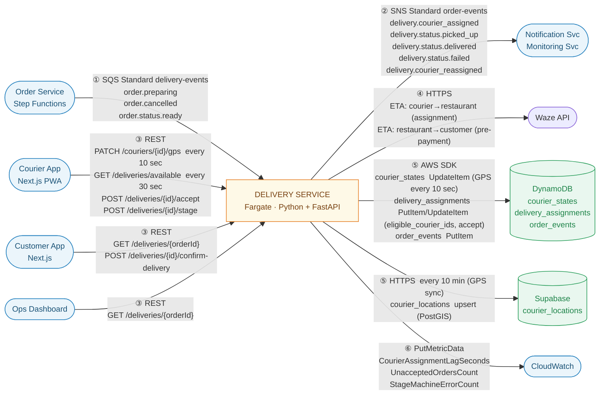

# Delivery Service — Inter-Service Message Contracts

**Service:** `delivery-service`  
**Runtime:** Python + FastAPI / AWS Fargate

---

## Channel Overview

| # | Channel | Direction | Transport |
|---|---------|-----------|-----------|
| 1 | [SQS Standard Inbound](#1-sqs-standard-inbound) | → Delivery Service | SQS Standard `delivery-events` |
| 2 | [SNS Standard Outbound](#2-sns-standard-outbound) | Delivery Service → | SNS Standard `order-events` |
| 3 | [REST Inbound](#3-rest-api-inbound) | Clients → Delivery Service | ALB / HTTPS |
| 4 | [REST Outbound](#4-rest-api-outbound) | Delivery Service → APIs | Waze API only — see §4 note (2026-07-16) |
| 5 | [DynamoDB Writes](#5-dynamodb-write-shapes) | Delivery Service → DynamoDB | AWS SDK |
| 6 | [CloudWatch Metrics](#6-cloudwatch-custom-metrics) | Delivery Service → CloudWatch | PutMetricData |

---

## Message Flow Overview



> Arrow numbers correspond to Channel Overview rows. `DS` ↔ `CA` and `DS` ↔ `CU` are bidirectional via REST.
> `DS` → `OS` is one-directional: Order Service pushes SQS events in (Ch.1); Delivery Service notifies back
> only via SNS `delivery.status.*` events (Ch.2), never a REST callback — the `PATCH /orders/{orderId}/status`
> call shown in earlier revisions of this diagram was removed 2026-07-16, confirmed never implemented (see
> §4 below). Waze API is called both during assignment (Ch.4) and for pre-payment ETA.

---

## 1. SQS Standard Inbound

> Messages consumed from the `delivery-events` SQS Standard queue (subscribed to SNS Standard topic `order-events`).  
> Dead Letter Queue (DLQ) triggers after **3 consecutive processing failures**.  
> No `MessageGroupId` or `MessageDeduplicationId` — standard SNS/SQS is used. Delivery Service handles rare duplicates by checking current order state before acting.

---

### `order.preparing`

Published by **Order Service** (Step Functions) via SNS Standard → SQS Standard fan-out. Triggers the courier **Assignment Engine** — the order is broadcast to nearby available couriers.

```json
{
  "eventType": "order.preparing",
  "eventId": "evt_01J0XYZ1234ABCD",
  "timestamp": "2026-06-28T18:50:00.000Z",
  "orderId": "order-xyz",
  "customerId": "user-123",
  "restaurantId": "rest-456",
  "restaurantAddress": {
    "lat": 32.0853,
    "lng": 34.7818,
    "street": "Rothschild Blvd 1",
    "city": "Tel Aviv"
  },
  "deliveryAddress": {
    "addressId": "addr-789",
    "lat": 32.0742,
    "lng": 34.7922,
    "street": "Ben Yehuda St 44",
    "city": "Tel Aviv"
  },
  "estimatedPickupTime": "2026-06-28T19:05:00.000Z",
  "estimatedDeliveryTime": "2026-06-28T19:30:00.000Z",
  "items": [
    { "menuItemId": "item-1", "name": "Shakshuka", "quantity": 2, "timeToPrepare": 15 }
  ],
  "totalAmount": 78.50,
  "currency": "ILS",
  "actorId": "SYSTEM"
}
```

---

### `order.cancelled`

Published by **Order Service** (Step Functions) on payment failure or invalid order. Delivery Service must release any pre-assigned courier.

```json
{
  "eventType": "order.cancelled",
  "eventId": "evt_01J0XYZ9999ABCD",
  "timestamp": "2026-06-28T18:55:00.000Z",
  "orderId": "order-xyz",
  "reason": "PAYMENT_FAILED",
  "actorId": "SYSTEM"
}
```

> **`reason` enum:** `PAYMENT_FAILED` · `INVALID_ORDER` · `CUSTOMER_CANCELLED`

---

### `order.status.ready`

Published by **Order Service** when the kitchen marks the order `READY`. Delivery Service updates the order's broadcast status so the assigned courier can see the food is ready for pickup.

```json
{
  "eventType": "order.status.ready",
  "eventId": "evt_01J0XYZ5678ABCD",
  "timestamp": "2026-06-28T19:05:00.000Z",
  "orderId": "order-xyz",
  "restaurantId": "rest-456",
  "courierId": "courier-001",
  "actorId": "rest-456"
}
```

---

## 2. SNS Standard Outbound

> All events published to SNS Standard topic `order-events`.  
> No ordering guarantees — consumers check current order state before acting.  
> **Consumers:** Notification Service · Monitoring Service · Order Service.

---

### `delivery.courier_assigned`

Emitted after **Assignment Engine** selects a courier (first courier to accept wins). Allows Notification Service to alert the customer.

| Field | Value |
|-------|-------|
| `SNSTopicArn` | `arn:aws:sns:eu-west-1:123456789012:order-events` |
| `Subject` | `delivery.courier_assigned` |

```json
{
  "eventType": "delivery.courier_assigned",
  "eventId": "evt_01J0DS1234ABCD",
  "timestamp": "2026-06-28T18:51:00.000Z",
  "orderId": "order-xyz",
  "courierId": "courier-001",
  "courierName": "Avi Cohen",
  "courierPhone": "+972501234567",
  "vehicleType": "bike",
  "estimatedPickupTime": "2026-06-28T19:05:00.000Z",
  "estimatedDeliveryTime": "2026-06-28T19:30:00.000Z",
  "actorId": "SYSTEM"
}
```

> **`vehicleType` enum:** `bike` · `car` · `walk`

---

### `delivery.status.picked_up`

Courier taps **Picked up**. Stage transition: `READY → PICKED_UP`.

| Field | Value |
|-------|-------|
| `Subject` | `delivery.status.picked_up` |

```json
{
  "eventType": "delivery.status.picked_up",
  "eventId": "evt_01J0DS2222ABCD",
  "timestamp": "2026-06-28T19:07:00.000Z",
  "orderId": "order-xyz",
  "courierId": "courier-001",
  "actorId": "courier-001"
}
```

---

### `delivery.status.delivered`

Both courier and customer tap **Confirm** in their respective apps. Stage transition: `PICKED_UP → DELIVERED`. **Terminal delivery event.**

> No photo required. Delivery is confirmed when BOTH courier (`POST /deliveries/{orderId}/stage` with `newStage: DELIVERED`) AND customer (`POST /deliveries/{orderId}/confirm-delivery`) have confirmed.

| Field | Value |
|-------|-------|
| `Subject` | `delivery.status.delivered` |

```json
{
  "eventType": "delivery.status.delivered",
  "eventId": "evt_01J0DS4444ABCD",
  "timestamp": "2026-06-28T19:28:00.000Z",
  "orderId": "order-xyz",
  "courierId": "courier-001",
  "courierConfirmed": true,
  "customerConfirmed": true,
  "confirmedBy": "COURIER",
  "actualDeliveryTime": "2026-06-28T19:28:00.000Z",
  "actorId": "courier-001"
}
```

> **`confirmedBy`** — records which party triggered the final status push: `COURIER` · `CUSTOMER`

---

### `delivery.status.failed`

Courier reports delivery failure. Stage transition: `PICKED_UP → FAILED`.

| Field | Value |
|-------|-------|
| `Subject` | `delivery.status.failed` |

```json
{
  "eventType": "delivery.status.failed",
  "eventId": "evt_01J0DS5555ABCD",
  "timestamp": "2026-06-28T19:35:00.000Z",
  "orderId": "order-xyz",
  "courierId": "courier-001",
  "failureReason": "CUSTOMER_UNREACHABLE",
  "failureNote": "Rang doorbell 3 times, no answer. Tried calling.",
  "actorId": "courier-001"
}
```

> **`failureReason` enum:** `CUSTOMER_UNREACHABLE` · `WRONG_ADDRESS` · `ACCESS_DENIED` · `CUSTOMER_REFUSED` · `OTHER`

---

### `delivery.courier_reassigned`

Emitted when the original courier cancels mid-delivery or becomes unresponsive. Ops and Notification services must be informed.

| Field | Value |
|-------|-------|
| `Subject` | `delivery.courier_reassigned` |

```json
{
  "eventType": "delivery.courier_reassigned",
  "eventId": "evt_01J0DS6666ABCD",
  "timestamp": "2026-06-28T19:10:00.000Z",
  "orderId": "order-xyz",
  "previousCourierId": "courier-001",
  "newCourierId": "courier-007",
  "reason": "COURIER_CANCELLED",
  "actorId": "SYSTEM"
}
```

> **`reason` enum:** `COURIER_CANCELLED` · `COURIER_UNRESPONSIVE` · `MANUAL_OPS`

---

## 3. REST API Inbound

> Endpoints exposed by Delivery Service via **ALB** (Fargate target group).  
> Courier App endpoints require `Authorization: Bearer <jwt_access_token>` (Cognito JWT).  
> Customer App endpoints require Firebase session cookie (verified server-side).

---

### `PATCH /api/v1/couriers/{courierId}/gps`

Courier App sends GPS position every **10 seconds**. Delivery Service writes to DynamoDB `courier_states.lastLocation`. This table is the live GPS source of truth; Supabase `courier_locations` is batch-synced from it every 10 minutes.

**Request body**
```json
{
  "lat": 32.0800,
  "lng": 34.7850,
  "timestamp": "2026-06-28T19:15:00.000Z"
}
```

**Response 204** — no body. (Corrected 2026-07-16: implemented and confirmed as `204`, not `200` — this
matches the service's own `README.md` and `courier-frontend`'s client, which guards for a `204` with no
JSON body. This doc previously disagreed with both.)

---

### `GET /api/v1/deliveries/eta`

Called by **Order Service** during checkout (before customer pays). Returns Waze-calculated travel time from restaurant to customer delivery address so the customer sees an accurate ETA.

**Request**
```
GET /api/v1/deliveries/eta?restaurantId=rest-456&deliveryLat=32.0742&deliveryLng=34.7922
Authorization: Bearer <internal_service_jwt>
```

**Response 200**
```json
{
  "estimatedDeliveryMinutes": 22,
  "restaurantToCustomerKm": 3.1,
  "calculatedAt": "2026-06-28T18:49:00.000Z"
}
```

> If Waze API is unavailable, the service returns a distance-based estimate and sets `"source": "fallback_distance"`.

---

### `GET /api/v1/deliveries/available`

Courier App polls every **30 seconds** for paid orders for which this courier is in the `eligible_courier_ids` list (written by Assignment Engine after Waze filtering). The courier's `courierId` is extracted from the JWT — no lat/lng parameter needed.

**Request**
```
GET /api/v1/deliveries/available
Authorization: Bearer <jwt_access_token>
```

**Response 200**
```json
{
  "availableOrders": [
    {
      "orderId": "order-xyz",
      "restaurantId": "rest-456",
      "restaurantName": "HaBurger",
      "restaurantAddress": { "lat": 32.0853, "lng": 34.7818, "street": "Rothschild Blvd 1" },
      "customerAddress": { "lat": 32.0742, "lng": 34.7922 },
      "estimatedPickupMinutes": 7,
      "estimatedDeliveryMinutes": 22,
      "estimatedEarnings": 18.50,
      "currency": "ILS",
      "items": [{ "name": "Shakshuka", "quantity": 2 }]
    }
  ]
}
```

---

### `POST /api/v1/deliveries/{orderId}/accept`

Courier accepts an available order. **First-writer wins** — Delivery Service performs a conditional DynamoDB write. If another courier already accepted, returns `409 Conflict`.

**Request body**
```json
{
  "courierId": "courier-001",
  "acceptedAt": "2026-06-28T18:51:45.000Z"
}
```

**Response 200**
```json
{
  "orderId": "order-xyz",
  "status": "ASSIGNED",
  "restaurantAddress": { "lat": 32.0853, "lng": 34.7818, "street": "Rothschild Blvd 1" }
}
```

**Response 409**
```json
{
  "error": "CONFLICT",
  "message": "Another courier accepted this order first"
}
```

> Corrected 2026-07-16: implemented as `"error": "CONFLICT"`, not `ALREADY_ASSIGNED` — matches
> `README.md`'s convention (this repo's `shared/errors/app_error.py` always raises `ConflictError` →
> `CONFLICT` for 409s). `courier-frontend` never depended on the exact string, only the `409` status code,
> so this was a safe pick.

---

### `POST /api/v1/deliveries/{orderId}/stage`

Courier updates delivery stage. Triggers the **Stage State Machine**.

**Request body**
```json
{
  "courierId": "courier-001",
  "newStage": "PICKED_UP",
  "failureReason": null
}
```

> **`newStage` enum:** `PICKED_UP` · `DELIVERED` · `FAILED`  
> `failureReason` — required when `newStage = FAILED`. Enum: `CUSTOMER_UNREACHABLE` · `WRONG_ADDRESS` · `ACCESS_DENIED` · `CUSTOMER_REFUSED` · `OTHER`

**Response 200**
```json
{
  "orderId": "order-xyz",
  "stage": "PICKED_UP",
  "updatedAt": "2026-06-28T19:07:00.000Z"
}
```

---

### `POST /api/v1/deliveries/{orderId}/confirm-delivery`

Customer confirms delivery in the Customer App. Once both courier (`newStage: DELIVERED`) and customer have confirmed, order transitions to `DELIVERED`.

**Request body**
```json
{
  "customerId": "user-123"
}
```

**Response 200**
```json
{
  "orderId": "order-xyz",
  "stage": "DELIVERED",
  "updatedAt": "2026-06-28T19:28:00.000Z"
}
```

---

### `GET /api/v1/deliveries/{orderId}`

Returns current delivery state for an order. Reads from DynamoDB `delivery_assignments` (this service's own
assignment/eligibility table — not Order Service's `active_orders`, see §4.7/§0.7) and `courier_states`
(courier last-known GPS).
**Callers:** Customer App · Ops Dashboard · Order Service.  
**Primary tracking mechanism for Customer App** — polled every 5 seconds. `courierLastLocation` reflects the last GPS push from Courier App (up to 10 sec old).

**Request**
```
GET /api/v1/deliveries/order-xyz
Authorization: Bearer <jwt_access_token>
```

**Response 200**
```json
{
  "orderId": "order-xyz",
  "status": "PICKED_UP",
  "courierId": "courier-001",
  "courierName": "Avi Cohen",
  "courierPhone": "+972501234567",
  "courierLastLocation": {
    "lat": 32.0800,
    "lng": 34.7850,
    "updatedAt": "2026-06-28T19:15:00.000Z"
  },
  "restaurantName": "HaBurger",
  "restaurantAddress": { "lat": 32.0853, "lng": 34.7818, "street": "Rothschild Blvd 1", "city": "Tel Aviv", "addressId": null },
  "customerAddress": { "lat": 32.0742, "lng": 34.7922, "street": "Ben Yehuda St 44", "city": "Tel Aviv", "addressId": "addr-789" },
  "estimatedDeliveryTime": "2026-06-28T19:30:00.000Z",
  "assignedAt": "2026-06-28T18:51:00.000Z",
  "pickedUpAt": "2026-06-28T19:07:00.000Z",
  "deliveredAt": null
}
```

> **`status` enum (delivery-owned):** `ASSIGNED` · `PICKED_UP` · `DELIVERED` · `FAILED`  
> `courierLastLocation` — last known position from Courier App GPS push (every 10 sec). Max staleness: ~10 sec.  
> **Added 2026-07-16:** `restaurantName` / `restaurantAddress` / `customerAddress` — previously missing
> from this response despite `courier-frontend`'s `Delivery.ts` needing them to navigate after accepting
> (see platform `ARCHITECTURE.md` and this repo's own `docs/ARCHITECTURE.md` §0.8). `restaurantName` is a
> best-effort Supabase `venues` lookup and can be `null`; the address objects are always present.

**Response 404**
```json
{
  "error": "NOT_FOUND",
  "message": "No delivery assignment found for order order-xyz"
}
```

> Corrected 2026-07-16: implemented as `"error": "NOT_FOUND"` (this repo's shared `NotFoundError` →
> `NOT_FOUND` convention), not `DELIVERY_NOT_FOUND`.

---

### `GET /health`

Fargate ECS health check. Returns `200` when all internal modules are ready; used by the ALB target group health check to determine task readiness.

**Response 200**
```json
{
  "status": "ok",
  "modules": {
    "sqsConsumer": "ready",
    "assignmentEngine": "ready",
    "gpsSyncScheduler": "ready",
    "wazeClient": "ready"
  },
  "timestamp": "2026-06-28T19:00:00.000Z"
}
```

> Corrected 2026-07-16: module keys are camelCase (`sqsConsumer`, not `sqs_consumer`), matching
> `README.md` and the actual implementation — this doc previously disagreed with both. `wazeClient` can
> also report `"not_configured"` (no `WAZE_API_KEY` set) — an accepted state, not a degradation; only
> `"error"` on any module marks the overall response `503`.

**Response 503** — returned when any critical module fails to initialise. ALB stops routing traffic to this task.
```json
{
  "status": "degraded",
  "modules": {
    "sqsConsumer": "error",
    "assignmentEngine": "ready",
    "gpsSyncScheduler": "ready",
    "wazeClient": "ready"
  },
  "timestamp": "2026-06-28T19:00:00.000Z"
}
```

---

## 4. REST API Outbound

> Calls made **by** Delivery Service **to** external APIs. **Status (2026-07-16):** the only real outbound
> call is to Waze. The courier-profile lookup once documented here as an outbound call to User Service is
> actually an endpoint Delivery Service exposes itself (see the note under §3 above), and the
> `PATCH /orders/{orderId}/status` outbound call was never implemented (§0.6, confirmed by grep) — both
> corrected below rather than kept as stale entries.

---

### `GET /api/v1/couriers/{courierId}/profile`

**Corrected 2026-07-16 — this is not an outbound call.** Delivery Service does not call out to a separate
User Service for this; it exposes this endpoint itself (see this repo's own `docs/PLAN.md` Phase 2), backed
by a best-effort direct Supabase query (`couriers` joined to `users`). `name`/`phone`/`vehicleType` are
`null` if Supabase isn't configured or the courier isn't found, rather than fabricated. It's called from the
**accept handler** (`POST /deliveries/{orderId}/accept`) to populate `delivery.courier_assigned` — not from
the Assignment Engine, which only computes eligibility and never fetches profile data (see this repo's own
`docs/PLAN.md` Phase 4, step 5).

**Request**
```
GET /api/v1/couriers/courier-001/profile
```

**Response 200**
```json
{
  "courierId": "courier-001",
  "name": "Avi Cohen",
  "phone": "+972501234567",
  "vehicleType": "bike"
}
```

---

### Waze API — ETA Calls

Called by the **Assignment Engine** (courier→restaurant) and **ETA handler** (restaurant→customer). Authentication via API key stored in AWS Secrets Manager.

#### Assignment: courier → restaurant (per candidate, up to 20 calls)

**Request**
```
GET https://waze.com/row-RoutingManager/routingRequest
  ?from=ll.{courierLat}%2C{courierLng}
  &to=ll.{restaurantLat}%2C{restaurantLng}
  &at=0&returnJSON=true
Authorization: <waze_api_key>
```

**Response (used fields)**
```json
{
  "alternatives": [
    {
      "response": {
        "totalRouteTime": 420
      }
    }
  ]
}
```

> `totalRouteTime` in seconds. Assignment Engine keeps couriers where `totalRouteTime / 60 ≤ X_MINUTES_THRESHOLD` (configurable, default 15 min).

#### Pre-payment ETA: restaurant → customer

Same endpoint, `from` = restaurant coords, `to` = customer delivery address coords. Returns `estimatedDeliveryMinutes` to Order Service for display at checkout.

---

### ~~`PATCH /api/v1/orders/{orderId}/status` → Order Service~~ — removed, never implemented

**Removed 2026-07-16.** This outbound REST call does not exist anywhere in Delivery Service's codebase and
was never built. `order-service-message-contracts.md`'s revision notes explicitly removed this endpoint —
"Delivery updates status only via SNS (consumed over SQS)" — and this repo's own
`docs/ARCHITECTURE.md` §0.6 documents that decision: **Delivery Service notifies Order Service only by
publishing `delivery.status.*` events to SNS** (§2 above), never via a direct REST callback. A grep for
`orders/{orderId}/status` or `orders.*status` across `delivery-service/src/` returns nothing. Do not
resurrect this as a design option without re-confirming with whoever owns Order Service first.

---

## 5. DynamoDB Write Shapes

> DynamoDB attribute type notation: `S` = String · `N` = Number · `M` = Map.

---

### Table: `courier_states`

| Key | Type | Notes |
|-----|------|-------|
| `courierId` | PK (S) | Partition key — UUID |

Live operational state for each courier. Written by Delivery Service on GPS updates, availability changes, courier assignment, and order completion. Replaces (upserts) the single item per courier — not append-only.  
Couriers submit GPS via `PATCH /api/v1/couriers/{courierId}/gps` every **10 seconds**. `lastLocation` is the live GPS source of truth. The GPS sync scheduler reads `lastLocation` every 10 minutes and batch-upserts Supabase `courier_locations` (PostGIS geometry) for nearest-courier spatial queries.

```json
{
  "courierId":      { "S": "courier-001" },
  "status":         { "S": "busy" },
  "currentOrderId": { "S": "order-xyz" },
  "vehicleType":    { "S": "bike" },
  "lastLocation": {
    "M": {
      "lat":       { "N": "32.08" },
      "lng":       { "N": "34.785" },
      "updatedAt": { "S": "2026-06-23T19:15:00.000Z" }
    }
  },
  "updatedAt": { "S": "2026-06-23T19:15:00.000Z" }
}
```

> **`status` enum:** `offline` · `available` · `busy`  
> **`vehicleType` enum:** `bike` · `car` · `walk`  
> `currentOrderId` — present only when `status = "busy"`; cleared when the order is completed or the courier goes offline

**Write triggers:**

| Event | `status` | `currentOrderId` |
|-------|----------|-----------------|
| Courier goes available | `available` | — |
| Courier goes offline | `offline` | cleared |
| Courier assigned to order | `busy` | set to `orderId` |
| `PATCH /couriers/{id}/gps` (every 10 sec) | unchanged | unchanged — only `lastLocation` updated |
| Order `DELIVERED` / `FAILED` | `available` | cleared |

**GSIs used by Delivery Service:**

| GSI | Purpose |
|-----|---------|
| `GSI_couriers_by_status` (PK: `status`, SK: `updatedAt`) | Assignment Engine queries `status = "available"` to find candidate couriers |
| `GSI_courier_by_current_order` (PK: `currentOrderId`) | Look up which courier is assigned to a given active order |

---

### Table: `order_events`

| Key | Type | Notes |
|-----|------|-------|
| `order_id` | PK (S) | Partition key |
| `event_time` | SK (S) | Sort key — ISO-8601 |

Written on **every delivery stage transition** by the Stage State Machine. Immutable audit log for compliance, analytics, and debugging.

```json
{
  "order_id":       { "S": "order-xyz" },
  "event_time":     { "S": "2026-06-28T19:28:00.000Z" },
  "event_type":     { "S": "delivery.status.delivered" },
  "stage":          { "S": "DELIVERED" },
  "previous_stage": { "S": "PICKED_UP" },
  "actor_id":       { "S": "courier-001" },
  "actor_type":     { "S": "COURIER" },
  "courier_id":     { "S": "courier-001" },
  "metadata": {
    "M": {
      "courier_confirmed":  { "BOOL": true },
      "customer_confirmed": { "BOOL": true },
      "confirmed_by":       { "S": "COURIER" }
    }
  },
  "event_id": { "S": "evt_01J0DS4444ABCD" }
}
```

> **`actor_type` enum:** `COURIER` · `CUSTOMER` · `SYSTEM`  
> No photo is stored — delivery is confirmed by mutual in-app tap only.

---

### Table: `delivery_assignments`

**Added 2026-07-16** — this table wasn't previously documented here. PK `order_id`, no SK. Delivery
Service's own courier-assignment/eligibility record, created on `order.preparing` and owned exclusively by
this service (never Order Service's `active_orders` — see §0.7 in this repo's own `docs/ARCHITECTURE.md`).
Field names are snake_case internally (unlike the camelCase wire DTOs) since this table has no cross-repo
contract of its own.

```json
{
  "order_id": "order-xyz",
  "restaurant_id": "rest-456",
  "restaurant_address": { "lat": 32.0853, "lng": 34.7818, "street": "Rothschild Blvd 1", "city": "Tel Aviv" },
  "delivery_address": { "lat": 32.0742, "lng": 34.7922, "address_id": "addr-789" },
  "items": [{ "name": "Shakshuka", "quantity": 2 }],
  "currency": "ILS",
  "total_amount": 78.50,
  "eligible_courier_ids": ["courier-001"],
  "assigned_courier_id": "courier-001",
  "stage": "PICKED_UP",
  "estimated_pickup_time": "2026-06-28T19:05:00.000Z",
  "estimated_delivery_time": "2026-06-28T19:30:00.000Z",
  "assigned_at": "2026-06-28T18:51:45.000Z",
  "picked_up_at": "2026-06-28T19:07:00.000Z",
  "delivered_at": null,
  "courier_confirmed": false,
  "customer_confirmed": false,
  "created_at": "2026-06-28T18:50:00.000Z",
  "updated_at": "2026-06-28T19:07:00.000Z"
}
```

> `stage` is absent (not an empty/null attribute — the key itself is omitted) until a courier accepts; the
> `DeliveryStage` enum (`ASSIGNED`/`PICKED_UP`/`DELIVERED`/`FAILED`) only models post-acceptance states.  
> `assigned_courier_id`'s conditional write (`attribute_not_exists`) is the first-writer-wins mechanism
> behind the accept endpoint's `409` — see §3 above.

---

## 6. CloudWatch Custom Metrics

> Published via `PutMetricData`. Namespace: `FoodDelivery/DeliveryService`.  
> All alarms fan out to the SNS ops alert topic.

| Metric | Unit | Example Value | Alarm Threshold |
|--------|------|---------------|-----------------|
| `CourierAssignmentLagSeconds` | Seconds | 8.4 | > 120 seconds |
| `UnacceptedOrdersCount` | Count | 0 | > 5 for > 5 min |
| `StageMachineErrorCount` | Count | 0 | > 5 errors / 5 min |
| `GpsSyncJobFailureCount` | Count | 0 | > 0 (any failure) |
| `WazeApiErrorRate` | Percent | 0.5 | > 10% per 5 min |
| `EligibleCouriersFound` | Count | 4 | < 1 for > 3 orders (no coverage alert) |

> **Status (2026-07-16):** all metrics except `UnacceptedOrdersCount` are emitted from real call sites
> (Assignment Engine, Waze client, GPS sync job, the stage endpoint). `UnacceptedOrdersCount` is a periodic
> aggregate ("orders still unaccepted after N minutes") with no natural per-event call site in what's been
> built so far — it belongs to a scheduled monitoring pass (Monitoring Service, platform `ARCHITECTURE.md`
> §4.2), not something Delivery Service's own request/event handlers can emit inline. Still an open item.

**Example `PutMetricData` shape**

```json
{
  "MetricName": "CourierAssignmentLagSeconds",
  "Namespace": "FoodDelivery/DeliveryService",
  "Unit": "Seconds",
  "Value": 8.4,
  "Dimensions": [
    { "Name": "Environment", "Value": "production" }
  ]
}
```

> `UnacceptedOrdersCount` above threshold indicates no available couriers in the area — ops team should investigate courier availability and consider expanding the broadcast radius.
